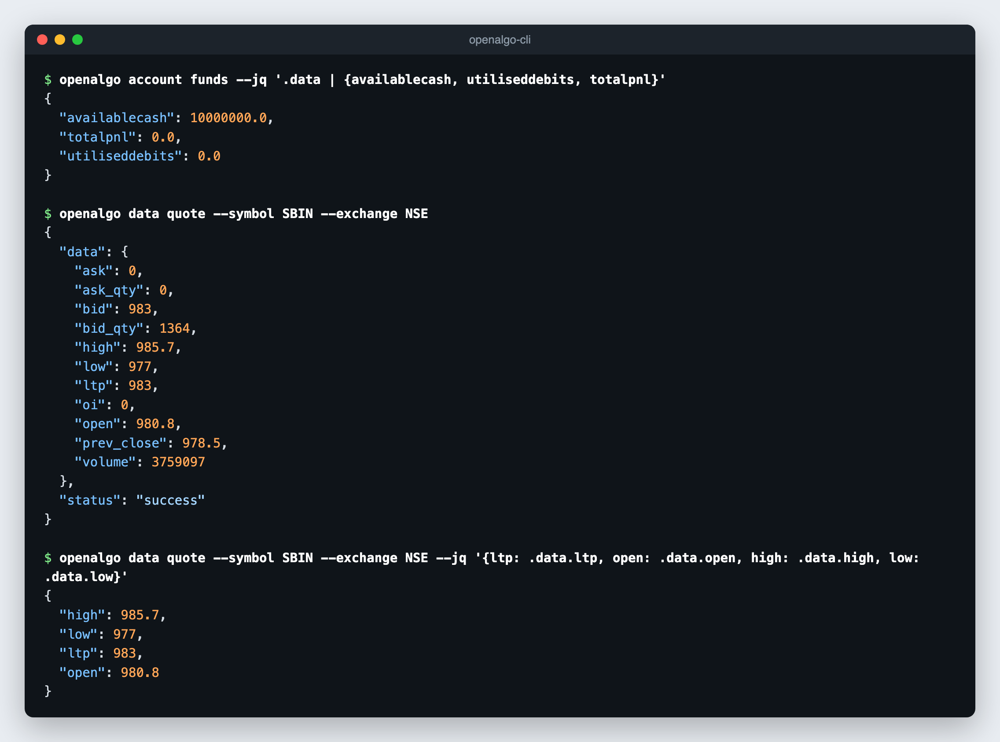

# OpenAlgo CLI

OpenAlgo CLI is a single Go binary that talks to your own OpenAlgo server over its REST and WebSocket APIs. It places and manages orders, reads positions, funds and holdings, pulls quotes, depth and historical candles, works with option chains and Greeks, operates Strategy Module runs, and streams live market data, with any broker OpenAlgo supports.

The CLI never connects to a broker directly. It sends requests to your OpenAlgo server, and the server's API key resolves the broker session.

The CLI is open source under the Apache-2.0 license: [github.com/marketcalls/openalgo-cli](https://github.com/marketcalls/openalgo-cli).

For a step-by-step walkthrough with screenshots, read the tutorial [OpenAlgo CLI: Trade, Stream and Automate Your Broker from the Terminal](https://blog.openalgo.in/openalgo-cli-trade-stream-and-automate-your-broker-from-the-terminal-39b780228004).


The CLI is an alpha preview. Commands, flags, and output formats may change between releases. The installed binary is the source of truth: run `openalgo --help-all` to see what your version supports.


## Built for Agents

The CLI is designed for AI agents, scripts, and automation pipelines first:

- Every parameter is an explicit `--flag`. Flag names are the API field names in kebab-case (`trigger_price` becomes `--trigger-price`).
- Every API command returns the OpenAlgo JSON response on stdout.
- Errors are JSON on stderr with meaningful exit codes.
- `--help-all` and `--schema` let an agent discover commands and response shapes at runtime without calling the API.
- `--dry-run` previews any state-changing request without sending it.

It is not an interactive trading terminal. There are no confirmation prompts, and every command executes immediately against whatever your OpenAlgo server is connected to. Whether an order is simulated or live depends on the server's analyzer mode (sandbox mode), not on the CLI.

## Use Cases

| Use case | How the CLI helps |
|---|---|
| AI agent harnesses | Give Claude Code, Codex, the Claude Agent SDK, or any tool-calling harness a shell tool and the CLI. The agent reads positions, funds and quotes, reasons about them, and places or manages orders. See [AI Agents](ai-agents.md). |
| Human-in-the-loop execution | An agent or script proposes an order with `--dry-run`, a human or policy layer approves the exact request body, and the same command is sent without `--dry-run`. |
| Scheduled automation | Cron jobs, CI, or task schedulers square off positions, snapshot P&L, or alert on rejected orders with a few lines of shell. |
| Multiple brokers and instances | One profile per OpenAlgo instance (`-p zerodha`, `-p dhan`) lets a single script or agent report on or act across every account. |
| Research and data pipelines | Historical candles, the instrument master, option chains, and Greeks go straight into pandas, DuckDB, or spreadsheets with `--csv`. |
| Live monitoring | `openalgo stream ltp`, `quote`, `depth`, and `orders` emit NDJSON for alerting scripts, dashboards, or an agent watching order updates. |
| Strategy Module operations | Start, stop, and audit strategies (runs, orders, risk events) from scripts or chat-ops. |
| Ops and debugging | `openalgo doctor` checks connectivity, the broker session, and analyzer mode. `--debug` and `--trace` show the exact request with the API key redacted, which helps reproduce a TradingView or Amibroker integration issue. |
| Universal adapter | Anything that can run a process (Excel VBA, Node, Rust, n8n, Make) can drive OpenAlgo without an SDK. |

### When Not to Use It

- **Latency-sensitive, tick-by-tick strategies.** Each command starts a new process and makes a fresh HTTP request. Use the Python SDK or the WebSocket API directly.
- **Long conversational sessions.** When an assistant is exploring an account interactively over many turns, the [MCP](../mcp/README.md) server fits better.

## CLI Compared to MCP

Both let an AI agent work with a running OpenAlgo instance.

| | OpenAlgo CLI | [MCP](../mcp/README.md) |
| --- | --- | --- |
| Interface | Shell commands with flags | Tool calls over the Model Context Protocol |
| Runs as | A single binary, one process per command | A long-running MCP server process |
| Works with | Any agent or script that can run a shell command, plus cron, CI, and other languages | MCP clients such as Claude Desktop, Cursor, and Windsurf |
| Output | JSON by default, CSV with `--csv`, filtered with `--jq` | Tool results returned to the model |
| Previewing writes | `--dry-run` prints the exact request body | Depends on the client's approval flow |
| Live data | `stream` commands emit NDJSON over WebSocket | Request and response only |
| Multiple instances | Profiles, selected per command with `-p` | One server entry per instance |
| Good for | Automation, scheduled jobs, pipelines, and agents with a shell tool | Conversational exploration of the account |

They compose. An agent can use MCP for conversation and the CLI for scripted, repeatable, or scheduled work.

## Quick Start

1. Install the CLI. See [Installation](installation.md).

```bash
curl -fsSL https://raw.githubusercontent.com/marketcalls/openalgo-cli/main/install.sh | sh
```

2. Save the server address and API key in a profile. See [Authentication and Profiles](authentication.md).

```bash
openalgo profile login
```

3. Check connectivity and the trading mode.

```bash
openalgo ping
openalgo analyzer status
```

4. Read the account and market data.

```bash
openalgo account funds
openalgo position list
openalgo data quote --symbol RELIANCE --exchange NSE
openalgo data history --symbol SBIN --exchange NSE --interval 5m --start-date 2026-09-01 --end-date 2026-09-25
```

<figure><figcaption></figcaption></figure>

5. Preview an order, then place it.

```bash
openalgo order place --symbol SBIN --exchange NSE --action BUY --quantity 1 --pricetype LIMIT --price 800 --product CNC --dry-run
openalgo order place --symbol SBIN --exchange NSE --action BUY --quantity 1 --pricetype LIMIT --price 800 --product CNC
openalgo order list
```

## Safety

Destructive commands act immediately and without confirmation:

- `openalgo position close-all` squares off every open position in the account. `--strategy` is a tag, not a filter.
- `openalgo order cancel-all` cancels every open order in the account.
- `openalgo strategy close-all` exits every open leg of a strategy run.
- `openalgo analyzer toggle --mode=false` switches the server out of analyzer mode, so every later order goes to the broker as a live order.

Run `openalgo analyzer status` before placing orders when you are not sure which mode the server is in. See [Responsibilities](../responsibilities.md).

## Pages in This Section

| Page | Covers |
|---|---|
| [Installation](installation.md) | Install scripts, Go, source builds, verification, and updates |
| [Authentication and Profiles](authentication.md) | Profiles, environment variables, and multiple OpenAlgo instances |
| [Command Reference](command-reference.md) | Every command, its API endpoint, and an example |
| [Output, Errors and Automation](output-and-automation.md) | JSON, CSV, jq, schemas, dry runs, errors, exit codes, and retries |
| [Streaming](streaming.md) | Live LTP, quote, depth, and order updates over WebSocket |
| [AI Agents](ai-agents.md) | Using the CLI and its agent skill inside agent harnesses |
