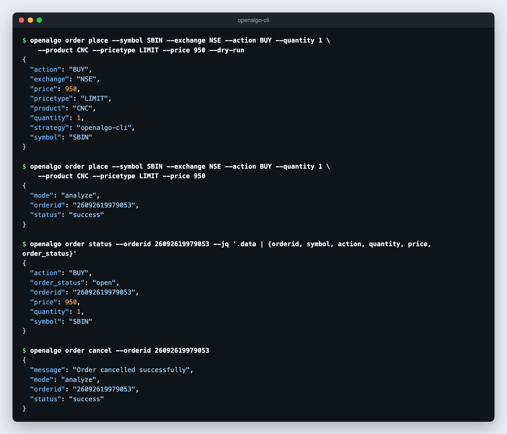

# AI Agents

Any agent that can run a shell command can use the OpenAlgo CLI: Claude Code, Codex, an agent built with the Claude Agent SDK, or any other tool-calling harness. The agent runs `openalgo` commands, reads JSON from stdout, and checks exit codes. No MCP server, SDK, or custom tool definitions are required.

The CLI is designed for this:

| Property | Why it matters to an agent |
|---|---|
| Explicit `--flag` parameters | No positional guessing; flag names match the API field names |
| JSON output by default | Parsed directly, no screen scraping |
| Structured JSON errors and exit codes | `0` success, `1` API error, `2` authentication error |
| `--help-all` and `--schema` | The agent discovers commands and response fields at runtime |
| Enum validation before sending | Bad `--exchange` or `--product` values fail locally, with the allowed values listed |
| `--dry-run` | Proposed writes can be shown to a person before they are sent |
| `--jq` | Responses are trimmed to the fields the agent needs, saving tokens |

## The Agent Skill

The CLI repository ships an agent skill at [`.agents/skills/openalgo-cli/SKILL.md`](https://github.com/marketcalls/openalgo-cli/blob/main/.agents/skills/openalgo-cli/SKILL.md). It teaches an agent how to install the CLI, authenticate, check analyzer (sandbox) mode, place orders safely, read errors, and avoid destructive commands without explicit intent.

Install it through [skills.sh](https://github.com/vercel-labs/skills), as with the other [OpenAlgo skills](../skills/README.md). Use `-l` to list the skills in the repository first, and `-g` to install globally. The repository also contains `openalgo-cli-regenerate`, which is for CLI contributors; agents that only use the CLI need `openalgo-cli`:

```bash
npx skills add marketcalls/openalgo-cli -l                     # list: openalgo-cli, openalgo-cli-regenerate
npx skills add marketcalls/openalgo-cli --skill openalgo-cli   # the usage skill
```

Or copy the skill directory into the location your agent reads. For Claude Code:

```bash
git clone https://github.com/marketcalls/openalgo-cli.git
mkdir -p ~/.claude/skills
cp -r openalgo-cli/.agents/skills/openalgo-cli ~/.claude/skills/
```

## Setting Up Credentials for an Agent

Give the agent credentials through environment variables so the key never appears in the conversation, the command line, or committed files:

```bash
export OPENALGO_API_KEY=<your_api_key>
export OPENALGO_HOST=http://127.0.0.1:5000
export OPENALGO_QUIET=1
```

Alternatively, run `openalgo profile login` yourself before the session, so the agent uses the stored profile. Never paste the API key into a prompt.

## Agent-Safe Patterns

### Check the Mode Before Trading

Whether an order is simulated or live is decided by the server's analyzer mode, not by the CLI. The agent should check it before any order:

```bash
openalgo analyzer status --quiet
```

Keep the server in analyzer (sandbox) mode while developing an agent workflow. An agent should never run `openalgo analyzer toggle --mode=false` unless you explicitly ask to go live.

### Dry Run, Then Send

For every state-changing command, have the agent show the `--dry-run` body first and send the same command only after approval:

```bash
openalgo order place --symbol SBIN --exchange NSE --action BUY --quantity 1 \
  --product CNC --pricetype LIMIT --price 950 --dry-run
# person approves the printed body
openalgo order place --symbol SBIN --exchange NSE --action BUY --quantity 1 \
  --product CNC --pricetype LIMIT --price 950
```

<figure><figcaption></figcaption></figure>

### Minimise Tokens with --jq

Full responses such as the order book or option chain can be large. Use `--schema` to learn the fields, then `--jq` to return only what the agent needs:

```bash
openalgo order list --schema
openalgo order list --jq '[.data.orders[] | select(.order_status == "open") | {orderid, symbol, action, quantity, price}]'
openalgo position list --jq '[.data[] | select((.quantity | tonumber) != 0) | {symbol, quantity, pnl}]'
openalgo data quote --symbol NIFTY --exchange NSE_INDEX --jq '.data.ltp'
```

### Never Guess Symbols

Look symbols and expiries up instead of constructing them:

```bash
openalgo symbol search --query "NIFTY 26000 OCT CE" --exchange NFO
openalgo symbol expiry --symbol NIFTY --exchange NFO --instrumenttype options
openalgo option symbol --underlying NIFTY --exchange NSE_INDEX --expiry-date 27OCT26 --offset ATM --option-type CE
openalgo symbol get --symbol NIFTY27OCT26FUT --exchange NFO --jq .data.lotsize
```

### Scope with Profiles

When several OpenAlgo instances are configured, pass `-p` on every command so the agent cannot act on the wrong account:

```bash
openalgo -p dhan position list
openalgo -p dhan order place --symbol SBIN --exchange NSE --action BUY --quantity 1 --product CNC --dry-run
```

For a stricter boundary, start the agent with only one instance's `OPENALGO_API_KEY` and `OPENALGO_HOST` in its environment.

### Bound Every Stream

`stream` commands run until Ctrl-C by default, which blocks an agent's shell tool. Always pass `--count` or `--duration`:

```bash
openalgo stream ltp --symbols NSE:SBIN --count 5
openalgo stream orders --duration 2m --jq '{orderid, order_status}'
```

### Handle Errors by Exit Code

| Exit code | Agent action |
|---|---|
| `0` | Continue |
| `1` | Read the `error` and `hint` fields on stderr and correct the request |
| `2` | Stop and ask the person to fix the credentials; do not retry |

If an error message starts with `outcome unknown`, the order may already exist. Check `openalgo order list` before retrying. See [Retries and Duplicate Orders](output-and-automation.md#retries-and-duplicate-orders).

### Keep Destructive Commands Behind Explicit Intent

`position close-all`, `order cancel-all`, `strategy close-all`, and `analyzer toggle --mode=false` act on the whole account or strategy with no confirmation. Instruct the agent to run them only when you ask for them by name. Harness permission settings that require approval for these commands add a second layer.

## Example Prompts

- "Check whether OpenAlgo is in analyzer mode, then show my open positions with non-zero quantity."
- "Find the ATM NIFTY call for the next weekly expiry and show me a dry run for buying one lot as NRML."
- "Pull 5-minute SBIN candles for the last week as CSV into `sbin.csv`."
- "Stream order updates for two minutes and tell me if anything is rejected."

## CLI or MCP

Use the CLI when the agent already has a shell tool, for scripted or repeatable workflows, for scheduled jobs, and when you want `--dry-run`, `--csv`, or streaming. Use [MCP](../mcp/README.md) for conversational sessions in MCP clients such as Claude Desktop. See [CLI Compared to MCP](README.md#cli-compared-to-mcp).
