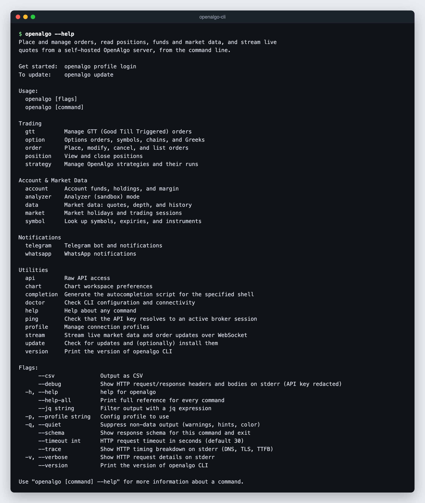

# Command Reference

The CLI is generated from a curated OpenAPI description of the OpenAlgo v1 API, so the installed binary is always the authoritative reference:

```bash
openalgo --help-all              # full reference for every command
openalgo order --help            # commands in one group
openalgo order place --help      # flags for one command
openalgo order place --schema    # response fields, without calling the API
```

`--help` marks required flags and lists the allowed values for enum flags such as `--exchange`, `--product`, `--pricetype`, and `--action`. Values outside the list are rejected before any request is sent.

<figure><figcaption></figcaption></figure>

## Conventions

- Every parameter is a `--flag`. Flag names are the API field names in kebab-case: `trigger_price` is `--trigger-price`, `position_size` is `--position-size`, `expiry_date` is `--expiry-date`, `strategy_id` is `--strategy-id`.
- Endpoint paths below are relative to `/api/v1`. The CLI adds the API key to every request.
- Commands that take a `strategy` field (`order`, `gtt`, `position get`, `position close-all`, `option order`, `option multi-order`) default `--strategy` to `openalgo-cli`, so CLI orders are easy to find in the order book. It is a tag, not a filter.
- Commands that change state accept `--dry-run`. See [Output, Errors and Automation](output-and-automation.md).
- `--expiry-date` accepts `DDMMMYY` (`27OCT26`) or the `DD-MMM-YY` form that `symbol expiry` prints (`27-OCT-26`).
- Symbols use the OpenAlgo format: equity `SBIN`, future `NIFTY27OCT26FUT`, option `NIFTY27OCT2626000CE`. See [Order Constants](../api-documentation/v1/order-constants.md).

## Global Flags

| Flag | Purpose |
|---|---|
| `--csv` | Output as CSV |
| `--jq <expr>` | Filter output with a jq expression (no external `jq` needed) |
| `-p`, `--profile <name>` | Config profile to use |
| `-q`, `--quiet` | Suppress non-data output (warnings, hints, color) |
| `--schema` | Show the response schema for the command and exit |
| `--timeout <seconds>` | HTTP request timeout. Default `30`. |
| `-v`, `--verbose` | Show HTTP request details on stderr |
| `--debug` | Show HTTP request and response headers and bodies on stderr, API key redacted |
| `--trace` | Show the HTTP timing breakdown on stderr (DNS, TLS, TTFB) |
| `--help-all` | Print the full reference for every command |
| `--version` | Print the CLI version |

## Orders

| Command | Endpoint | Description |
|---|---|---|
| `order place` | `/placeorder` | Place an order |
| `order smart` | `/placesmartorder` | Place an order sized against the current position (`--position-size`) |
| `order basket` | `/basketorder` | Place several orders at once (`--orders` JSON array) |
| `order split` | `/splitorder` | Split a large order into child orders of `--splitsize` |
| `order modify` | `/modifyorder` | Modify an open order |
| `order cancel` | `/cancelorder` | Cancel one order |
| `order cancel-all` | `/cancelallorder` | Cancel every open order in the account |
| `order status` | `/orderstatus` | Status of one order |
| `order list` | `/orderbook` | Order book |
| `order trades` | `/tradebook` | Trade book |

```bash
openalgo order place --symbol SBIN --exchange NSE --action BUY --quantity 1 --product CNC --pricetype MARKET
openalgo order place --symbol NIFTY27OCT26FUT --exchange NFO --action SELL --quantity 65 --product NRML --pricetype SL --price 24990 --trigger-price 25000
openalgo order smart --symbol SBIN --exchange NSE --action BUY --quantity 1 --position-size 5 --product CNC
openalgo order basket --orders @basket.json
openalgo order split --symbol YESBANK --exchange NSE --action BUY --quantity 105 --splitsize 20 --product CNC
openalgo order modify --orderid 250408000989443 --symbol SBIN --exchange NSE --action BUY --product CNC --pricetype LIMIT --price 780 --quantity 1
openalgo order cancel --orderid 250408000989443
openalgo order cancel-all --dry-run
openalgo order status --orderid 250408000989443 --jq '.data.order_status'
openalgo order list --jq '.data.orders[] | select(.order_status == "open")'
openalgo order trades --csv
```

When `--product` or `--pricetype` is omitted the server applies `MIS` and `MARKET`. `SL` and `SL-M` orders need `--trigger-price`. `order modify` sends `--disclosed-quantity 0` and `--trigger-price 0` unless you set them.

## GTT Orders

| Command | Endpoint | Description |
|---|---|---|
| `gtt place` | `/placegttorder` | Place a GTT order (`SINGLE` or `OCO`; `CNC` or `NRML` only) |
| `gtt modify` | `/modifygttorder` | Modify an active GTT order |
| `gtt cancel` | `/cancelgttorder` | Cancel an active GTT order |
| `gtt list` | `/gttorderbook` | List GTT triggers (`--status active` or `all`) |

```bash
openalgo gtt place --trigger-type SINGLE --symbol SBIN --exchange NSE --action BUY --product CNC --quantity 1 --pricetype LIMIT --price 756 --triggerprice-sl 755
openalgo gtt place --trigger-type OCO --symbol SBIN --exchange NSE --action SELL --product CNC --quantity 1 --price 0 --triggerprice-sl 740 --stoploss 739 --triggerprice-tg 860 --target 861
openalgo gtt modify --trigger-id 123456789 --trigger-type SINGLE --symbol SBIN --exchange NSE --action BUY --product CNC --quantity 2 --price 751 --triggerprice-sl 750
openalgo gtt cancel --trigger-id 123456789
openalgo gtt list --status all --csv
```

## Positions

| Command | Endpoint | Description |
|---|---|---|
| `position list` | `/positionbook` | Position book |
| `position get` | `/openposition` | Open quantity for one symbol |
| `position close-all` | `/closeposition` | Square off every open position in the account |

```bash
openalgo position list --jq '.data[] | select((.quantity | tonumber) != 0)'
openalgo position get --symbol SBIN --exchange NSE --product CNC
openalgo position close-all --dry-run
```

## Options

| Command | Endpoint | Description |
|---|---|---|
| `option order` | `/optionsorder` | Place an option order by strike offset (`ATM`, `ITM1` to `ITM50`, `OTM1` to `OTM50`) |
| `option multi-order` | `/optionsmultiorder` | Multi-leg option order (`--legs` JSON array, 1 to 20 legs) |
| `option symbol` | `/optionsymbol` | Resolve an option symbol from an offset |
| `option chain` | `/optionchain` | Option chain, optionally with Greeks |
| `option greeks` | `/optiongreeks` | Implied volatility and Greeks for one option |
| `option multi-greeks` | `/multioptiongreeks` | Greeks for up to 50 options |
| `option synthetic-future` | `/syntheticfuture` | Synthetic future price |

```bash
openalgo option order --underlying NIFTY --exchange NSE_INDEX --expiry-date 27OCT26 --offset ATM --option-type CE --action BUY --quantity 65 --product NRML
openalgo option multi-order --underlying NIFTY --exchange NSE_INDEX --expiry-date 27OCT26 --legs @legs.json
openalgo option symbol --underlying NIFTY --exchange NSE_INDEX --expiry-date 27OCT26 --offset ATM --option-type CE
openalgo option chain --underlying NIFTY --exchange NSE_INDEX --expiry-date 27OCT26 --strike-count 5 --with-greeks
openalgo option greeks --symbol NIFTY27OCT2626000CE --exchange NFO
openalgo option multi-greeks --symbols '[{"symbol":"NIFTY27OCT2626000CE","exchange":"NFO"},{"symbol":"NIFTY27OCT2626000PE","exchange":"NFO"}]'
openalgo option synthetic-future --underlying NIFTY --exchange NSE_INDEX --expiry-date 27OCT26
```

F&O quantities must be a multiple of the lot size. Check it with `openalgo symbol get --symbol <symbol> --exchange NFO --jq .data.lotsize`.

## Strategies

These commands operate the Strategy Module.

| Command | Endpoint | Description |
|---|---|---|
| `strategy list` | `/strategy/list` | List strategies (`--status`, `--query`) |
| `strategy status` | `/strategy/status` | One strategy's configuration and current run |
| `strategy start` | `/strategy/start` | Start a run with `--mode sandbox` or `--mode live` |
| `strategy stop` | `/strategy/stop` | Stop a run |
| `strategy close-all` | `/strategy/close_all` | Exit every open leg of a strategy run |
| `strategy close-leg` | `/strategy/close_leg` | Exit one leg |
| `strategy runs` | `/strategy/runs` | Run history |
| `strategy orders` | `/strategy/orders` | Orders placed by a strategy |
| `strategy events` | `/strategy/events` | Risk and lifecycle event log (`--severity`, `--kind`, `--run-id`) |

```bash
openalgo strategy list --status running
openalgo strategy status --strategy-id 12
openalgo strategy start --strategy-id 12 --mode sandbox
openalgo strategy stop --strategy-id 12
openalgo strategy close-all --strategy-id 12
openalgo strategy close-leg --strategy-id 12 --leg-id 2
openalgo strategy runs --strategy-id 12 --limit 10 --csv
openalgo strategy orders --strategy-id 12 --run-id 40 --csv
openalgo strategy events --strategy-id 12 --severity critical --limit 50
```

`--mode` is exact and case-sensitive. `live` places real orders.

## Account

| Command | Endpoint | Description |
|---|---|---|
| `account funds` | `/funds` | Available cash and margin used |
| `account holdings` | `/holdings` | Demat holdings |
| `account margin` | `/margin` | Margin required for a basket of positions (`--positions` JSON array) |

```bash
openalgo account funds
openalgo account holdings --csv
openalgo account margin --positions '[{"symbol":"NIFTY27OCT26FUT","exchange":"NFO","action":"BUY","quantity":"65","product":"NRML","pricetype":"MARKET"}]'
```

## Market Data

| Command | Endpoint | Description |
|---|---|---|
| `data quote` | `/quotes` | Quote for one symbol |
| `data quotes` | `/multiquotes` | Quotes for several symbols (`--symbols` JSON array) |
| `data depth` | `/depth` | Market depth |
| `data history` | `/history` | Historical candles (`--source api` or `db` for local Historify data) |
| `data intervals` | `/intervals` | Intervals the broker supports |
| `data ticker` | `/ticker/{symbol}` | Ticker-compatible candles, JSON or text (`--format`) |

```bash
openalgo data quote --symbol NIFTY --exchange NSE_INDEX --jq '.data.ltp'
openalgo data quotes --symbols '[{"symbol":"RELIANCE","exchange":"NSE"},{"symbol":"INFY","exchange":"NSE"}]'
openalgo data depth --symbol SBIN --exchange NSE
openalgo data history --symbol NIFTY --exchange NSE_INDEX --interval 5m --start-date 2026-09-24 --end-date 2026-09-25 --csv
openalgo data intervals
openalgo data ticker --symbol NSE:SBIN --interval 5m --from 2026-09-24 --to 2026-09-25 --format txt
```

## Symbols

| Command | Endpoint | Description |
|---|---|---|
| `symbol get` | `/symbol` | Symbol details, including lot size and tick size |
| `symbol search` | `/search` | Search symbols |
| `symbol expiry` | `/expiry` | Expiry dates for futures or options |
| `symbol instruments` | `/instruments` | Instrument master download (JSON or `--format csv`) |

```bash
openalgo symbol get --symbol NIFTY27OCT26FUT --exchange NFO
openalgo symbol search --query "NIFTY 26000 OCT CE" --exchange NFO
openalgo symbol expiry --symbol NIFTY --exchange NFO --instrumenttype options
openalgo symbol instruments --exchange NFO --format csv > nfo.csv
```

## Market Calendar

| Command | Endpoint | Description |
|---|---|---|
| `market holidays` | `/market/holidays` | Exchange holidays for a year |
| `market timings` | `/market/timings` | Trading sessions for a date |

```bash
openalgo market holidays --year 2026 --csv
openalgo market timings --date 2026-09-25
```

## Analyzer (Sandbox) Mode

| Command | Endpoint | Description |
|---|---|---|
| `analyzer status` | `/analyzer` | Whether the server is in analyzer mode |
| `analyzer toggle` | `/analyzer/toggle` | Switch analyzer mode on (`--mode=true`) or off (`--mode=false`) |
| `analyzer pnl` | `/pnl/symbols` | Sandbox P&L by symbol |

```bash
openalgo analyzer status
openalgo analyzer toggle --mode=true
openalgo analyzer pnl --csv
```

Analyzer mode belongs to the server. While it is on, the server simulates orders against live market data, and positions, funds, and the order book reflect the sandbox. In analyzer mode, `MIS` orders are refused after the square-off time (15:15 IST by default) until the next session; use `CNC` for equity and `NRML` for futures and options. See [API Analyzer](../new-features/api-analyzer.md).

## Notifications

| Command | Endpoint | Description |
|---|---|---|
| `telegram config get` | `GET /telegram/config` | Telegram bot configuration |
| `telegram config set` | `POST /telegram/config` | Update the bot configuration |
| `telegram start` | `/telegram/start` | Start the Telegram bot |
| `telegram stop` | `/telegram/stop` | Stop the Telegram bot |
| `telegram users` | `GET /telegram/users` | Linked Telegram users |
| `telegram stats` | `GET /telegram/stats` | Bot usage statistics |
| `telegram broadcast` | `/telegram/broadcast` | Send a message to all users |
| `telegram notify` | `/telegram/notify` | Send a message to one user |
| `telegram preferences get` | `GET /telegram/preferences` | One user's notification preferences |
| `telegram preferences set` | `POST /telegram/preferences` | Update one user's preferences |
| `whatsapp notify` | `/whatsapp/notify` | Send a WhatsApp message |

```bash
openalgo telegram config get
openalgo telegram config set --broadcast-enabled=false --rate-limit-per-minute 30
openalgo telegram start
openalgo telegram stop
openalgo telegram users --csv
openalgo telegram stats --days 30
openalgo telegram broadcast --message "Markets open in 15 minutes"
openalgo telegram notify --username admin --message "Stoploss hit" --priority 9
openalgo telegram preferences get --telegram-id 123456789
openalgo telegram preferences set --telegram-id 123456789 --daily-summary=true --summary-time 15:45
openalgo whatsapp notify --self=true --message "SBIN order placed"
```

## Utilities

| Command | Endpoint | Description |
|---|---|---|
| `ping` | `/ping` | Check that the API key resolves to an active broker session |
| `chart get` | `GET /chart` | Chart workspace preferences |
| `chart set` | `POST /chart` | Merge keys into chart preferences (`--preferences` JSON object) |
| `stream ltp` / `quote` / `depth` / `orders` | WebSocket | Live feeds as NDJSON. See [Streaming](streaming.md). |
| `profile login` / `list` / `switch` / `logout` | None | Manage stored profiles. See [Authentication and Profiles](authentication.md). |
| `api [METHOD] <path>` | Any | Raw API request. See [Output, Errors and Automation](output-and-automation.md#raw-api-access). |
| `doctor` | None (runs checks) | Check configuration, connectivity, broker session, and analyzer mode |
| `update` | None | Check for and install CLI updates (`--check`, `--yes`) |
| `version` | None | Print the CLI version |
| `completion` | None | Shell completion scripts for bash, zsh, fish, and PowerShell |

```bash
openalgo ping
openalgo chart set --preferences '{"theme":"dark"}'
openalgo stream ltp --symbols NSE:RELIANCE,NSE:SBIN --count 5
openalgo profile switch office
openalgo api POST /quotes --body '{"symbol":"RELIANCE","exchange":"NSE"}'
openalgo doctor --profile office
openalgo update --check
openalgo version
openalgo completion zsh
```
