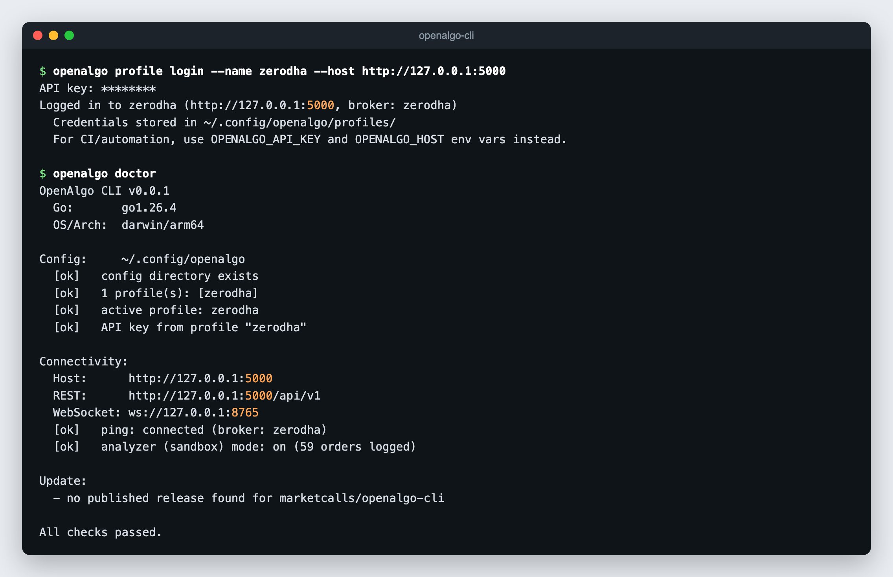

# Installation

## Prerequisites

1. **A running OpenAlgo server**, logged in to your broker. The default address is `http://127.0.0.1:5000`. See the OpenAlgo installation guides in this documentation.
2. **An OpenAlgo API key**, generated on the server's **API Key** page.

Your broker credentials never touch the CLI. The API key resolves the broker session on the server.

Go is **not** required for the install scripts. They install a prebuilt single binary for macOS, Linux, or Windows on amd64 or arm64. Go 1.24 or newer is needed only for `go install` or to build from source.

## Install Script

**macOS and Linux:**

```bash
curl -fsSL https://raw.githubusercontent.com/marketcalls/openalgo-cli/main/install.sh | sh
```

**Windows (PowerShell):**

```powershell
irm https://raw.githubusercontent.com/marketcalls/openalgo-cli/main/install.ps1 | iex
```

The install scripts verify the release checksum and accept two environment variables:

| Variable | Purpose |
|---|---|
| `OPENALGO_CLI_VERSION` | Release tag to install, for example `v0.0.1`. Defaults to the latest release. |
| `OPENALGO_INSTALL_DIR` | Install directory. Defaults to `/usr/local/bin`, or `~/.local/bin` when that is not writable, on macOS and Linux, and `%LOCALAPPDATA%\Programs\openalgo` on Windows. |

```bash
curl -fsSL https://raw.githubusercontent.com/marketcalls/openalgo-cli/main/install.sh \
  | OPENALGO_CLI_VERSION=v0.0.1 OPENALGO_INSTALL_DIR="$HOME/.local/bin" sh
```

## Go

With Go 1.24 or newer:

```bash
go install github.com/marketcalls/openalgo-cli/cmd/openalgo@latest
```

Make sure `$(go env GOPATH)/bin` (usually `~/go/bin`) is on your `PATH`.

## From Source

```bash
git clone https://github.com/marketcalls/openalgo-cli.git
cd openalgo-cli
make build            # binary at bin/openalgo
make install          # or install into $GOPATH/bin
```

Without `make`, build directly with `go build -o bin/openalgo ./cmd/openalgo`.

## Homebrew

Coming soon. Once the tap is published the command will be `brew install marketcalls/tap/openalgo-cli`.

## Verify

```bash
openalgo version
openalgo doctor
```

`openalgo doctor` checks the config directory, the active profile, where the API key comes from, server reachability, the broker session, and whether the server is in analyzer (sandbox) mode. Run it after [logging in](authentication.md).

<figure><figcaption></figcaption></figure>

## Shell Completion

```bash
openalgo completion bash
openalgo completion zsh
openalgo completion fish
openalgo completion powershell
```

Save the generated script where your shell expects completions, then open a new shell. Enum flags such as `--exchange`, `--product`, `--pricetype`, and `--action` complete with their allowed values.

## Update

```bash
openalgo update          # check for updates and prompt to install
openalgo update --yes    # check and install without prompting
openalgo update --check  # machine-readable JSON update check
```

`openalgo update` upgrades the CLI using the method it was installed with:

| Install method | Upgrade command |
|---|---|
| Install script (`install.sh` or `install.ps1`) | Re-runs the install script with `OPENALGO_INSTALL_DIR` set to the current binary's directory |
| Go | `go install github.com/marketcalls/openalgo-cli/cmd/openalgo@latest` |
| Homebrew | `brew upgrade marketcalls/tap/openalgo-cli` |

## Troubleshooting

| Symptom | Fix |
|---|---|
| `command not found: openalgo` | Add the install directory to `PATH`. For `go install`, that is `$(go env GOPATH)/bin`. |
| Connection refused | The OpenAlgo server is not running, or the host is wrong. Run `openalgo doctor`. |
| Exit code `2` on every command | The API key is missing, invalid, or belongs to another server. Regenerate it on the API Key page and run `openalgo profile login` again. |
| 5xx errors on data or order commands | The broker session on the server has usually expired. Log in to the broker again from the OpenAlgo dashboard. |
