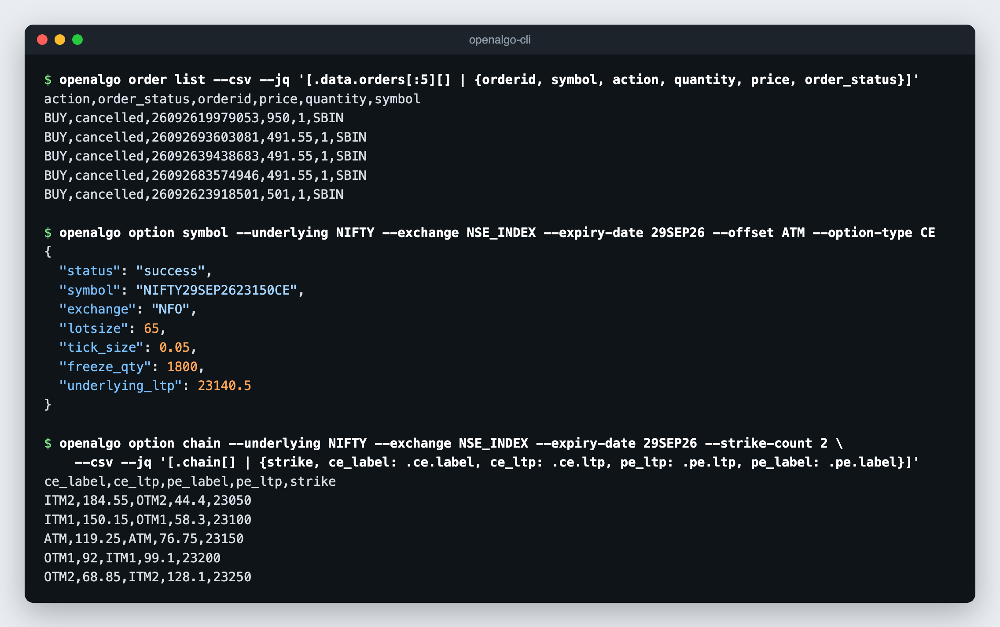
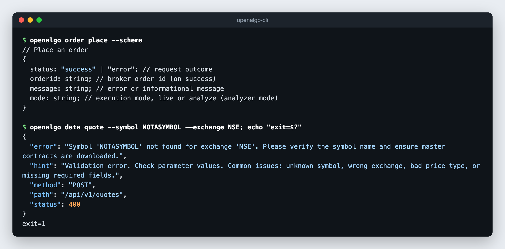

# Output, Errors and Automation

API commands (`order`, `position`, `account`, `data`, `option`, `strategy`, and the rest) are the automation surface. They return the OpenAlgo JSON response on stdout, write errors as JSON on stderr, and exit with a meaningful code.

Operational commands (`version`, `doctor`, `profile`, `update`, `completion`, and help) print human-readable text. The exception is `openalgo update --check`, which prints JSON.

## Output Formats

| Flag | Effect |
|---|---|
| (none) | The OpenAlgo JSON response, pretty-printed |
| `--csv` | The list inside the response as CSV |
| `--jq <expr>` | Apply a jq expression. No external `jq` install is needed. |
| `--schema` | Print the response fields for the command without calling the API |
| `--quiet`, `-q` | Suppress warnings, hints, and color, leaving only data |
| `--timeout <seconds>` | HTTP request timeout. Default `30`. |

```bash
openalgo position list
openalgo position list --csv
openalgo order list --jq '.data.orders[] | {orderid, symbol, order_status}'
openalgo account funds --quiet
openalgo data history --symbol NIFTY --exchange NSE_INDEX --interval D --start-date 2025-01-01 --end-date 2026-09-25 --timeout 120
openalgo order list --schema
```

Set `OPENALGO_OUTPUT=csv` to make CSV the default, and `OPENALGO_QUIET=1` to make quiet mode the default.

### CSV

`--csv` renders the list inside the response as rows, for example the orders in the order book, basket and split results, multi-quote results, or option chain strikes. Nested objects become dotted columns (`data.ltp`, `ce.ltp`), arrays are written as JSON text, numbers keep the exact text the server sent, and a list of plain values (such as expiry dates) becomes one column.

`--jq` runs before `--csv`, so you can select and rename columns first:

```bash
openalgo order list --csv --jq '[.data.orders[:5][] | {orderid, symbol, action, quantity, price, order_status}]'
openalgo option chain --underlying NIFTY --exchange NSE_INDEX --expiry-date 29SEP26 --strike-count 2 \
  --csv --jq '[.chain[] | {strike, ce_label: .ce.label, ce_ltp: .ce.ltp, pe_ltp: .pe.ltp, pe_label: .pe.label}]'
```

<figure><figcaption></figcaption></figure>

Non-JSON responses, such as `symbol instruments --format csv` and `data ticker --format txt`, are written to stdout verbatim. `--jq` on them is an error.

### Schemas

`--schema` shows the response shape for any API command, including `stream` commands, without a network call. Agents use it to learn field names before writing a `--jq` filter.

```bash
openalgo order place --schema
openalgo option chain --schema
openalgo stream ltp --schema
```

## Dry Run

Every command that changes state accepts `--dry-run`. It validates the flags, prints the exact JSON request body, and exits without sending anything. The API key is never included.

```bash
openalgo order place --symbol SBIN --exchange NSE --action BUY --quantity 1 \
  --product CNC --pricetype LIMIT --price 950 --dry-run
```

```json
{
  "action": "BUY",
  "exchange": "NSE",
  "price": 950,
  "pricetype": "LIMIT",
  "product": "CNC",
  "quantity": 1,
  "strategy": "openalgo-cli",
  "symbol": "SBIN"
}
```

This supports a human-in-the-loop flow: an agent or script proposes the order with `--dry-run`, a person or policy layer approves the body, and the same command runs without `--dry-run`.

<figure><figcaption></figcaption></figure>

## Errors

Errors are JSON on stderr with the fields `error`, `status`, `hint`, `method`, and `path`:

```json
{
  "error": "Invalid openalgo apikey",
  "status": 403,
  "hint": "Invalid API key, or the operation is blocked by the current mode. Run `openalgo profile login` or check the key under API Key in the OpenAlgo dashboard.",
  "method": "POST",
  "path": "/api/v1/funds"
}
```

OpenAlgo can return HTTP 200 with `{"status":"error"}`. The CLI treats that as an error too. When the server cannot be reached, `status` is `0`.

<figure><figcaption></figcaption></figure>

### Exit Codes

| Code | Meaning |
|---|---|
| `0` | Success |
| `1` | API or general error |
| `2` | Authentication error (HTTP 401 or 403) |

Scripts should check the exit code rather than parse stderr. Do not retry on exit code `2`; fix the credentials first.

## Retries and Duplicate Orders

OpenAlgo has no idempotency key, so the CLI retries conservatively. Up to three attempts are made with exponential backoff, honouring `Retry-After` on 429.

| Request type | Retried on |
|---|---|
| Read-only (quotes, books, funds, history) | 429, 502, 503, 504, and 500 responses without an OpenAlgo error body |
| State-changing (orders, cancels, toggles, strategy start and stop) | 429 only |
| Raw `openalgo api` calls | 429 only; never retried on server errors |

A 429 is rejected by the rate limiter before the request reaches the handler, so it is always safe to repeat. An order-changing request is never replayed after a server error, because the broker may already have accepted it.

When a state-changing request times out or loses its connection after it was sent, or a gateway answers 502, 503, or 504, the error message starts with `outcome unknown`. The order may exist. Check `openalgo order list` or `openalgo order trades` before retrying, or you may place a duplicate.

See [Rate Limiting](../api-documentation/v1/rate-limiting.md) for the server's limits.

## JSON-Valued Flags

Flags that carry arrays or objects take literal JSON, `@path/to/file.json`, or `-` for stdin:

| Flag | Commands | Shape |
|---|---|---|
| `--orders` | `order basket` | Array of orders |
| `--legs` | `option multi-order` | Array of 1 to 20 legs |
| `--positions` | `account margin` | Array of 1 to 50 positions |
| `--symbols` | `data quotes`, `option multi-greeks` | Array of `{symbol, exchange}` |
| `--phones` | `whatsapp notify` | Array of up to 5 phone numbers |
| `--preferences` | `chart set` | Object |
| `--filters` | `telegram broadcast` | Object |

```bash
openalgo data quotes --symbols '[{"symbol":"RELIANCE","exchange":"NSE"},{"symbol":"INFY","exchange":"NSE"}]'
openalgo order basket --orders @basket.json
cat legs.json | openalgo option multi-order --underlying NIFTY --exchange NSE_INDEX --expiry-date 27OCT26 --legs -
```

Array flags must be JSON arrays. `--help` lists the item fields each one needs.

## Raw API Access

`openalgo api [METHOD] <path>` calls any endpoint, including ones the generated commands do not cover. Paths are relative to `/api/v1`, and the API key is added for you: to the JSON body for POST, and to the `apikey` query parameter for GET. The method defaults to POST, or to GET when only `--query` is given.

| Flag | Purpose |
|---|---|
| `--body` | JSON request body: an object, `@file`, or `-` for stdin |
| `--query` | Query string to append, for example `exchange=NSE&format=json` |

```bash
openalgo api POST /funds
openalgo api POST /quotes --body '{"symbol":"RELIANCE","exchange":"NSE"}'
openalgo api GET /instruments --query "exchange=NSE"
echo '{"symbol":"SBIN","exchange":"NSE"}' | openalgo api POST /depth
openalgo api POST /quotes --body @quote.json --csv
```

Piped or redirected stdin is also read as the body. Piped stdin that stays silent for 2 seconds counts as no body, so an inherited open pipe never hangs the command. With `--csv`, the response's `data` field is rendered as rows.

## Destructive Commands

These commands act immediately on everything in scope, with no confirmation:

| Command | Effect |
|---|---|
| `openalgo position close-all` | Squares off every open position in the account, across all exchanges. `--strategy` is a tag, not a filter. |
| `openalgo order cancel-all` | Cancels every open order in the account. |
| `openalgo strategy close-all --strategy-id N` | Exits every open leg of a strategy run. |
| `openalgo analyzer toggle --mode=false` | Switches the server out of analyzer mode, so every later order is live. |

Run them with `--dry-run` first when in doubt, and check `openalgo analyzer status` before placing orders.

## Automation Recipes

Square off at a fixed time from cron (on the server's time zone):

```bash
# crontab: 15:10 on weekdays
10 15 * * 1-5 OPENALGO_API_KEY=... /usr/local/bin/openalgo position close-all --quiet >> ~/squareoff.log 2>&1
```

Alert on rejected orders:

```bash
rejected=$(openalgo order list --quiet --jq '[.data.orders[] | select(.order_status == "rejected")] | length')
if [ "$rejected" -gt 0 ]; then
  openalgo telegram notify --username admin --message "$rejected rejected orders" --quiet
fi
```

Snapshot the position book to a dated CSV:

```bash
openalgo position list --csv --quiet > "positions-$(date +%F).csv"
```

## Diagnostics

```bash
openalgo doctor                    # config, server reachability, API key, analyzer mode
openalgo account funds --verbose   # request summary on stderr
openalgo account funds --trace     # DNS, TLS, TTFB, and total timing on stderr
openalgo account funds --debug     # headers and bodies on stderr
```

The API key is always scrubbed from diagnostic output.
