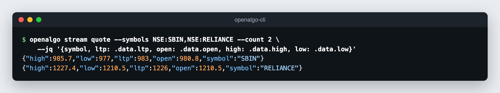

# Streaming

`openalgo stream` connects to the OpenAlgo WebSocket server, authenticates with the API key, subscribes, and prints every message as one JSON object per line (NDJSON) on stdout. When the stream ends it unsubscribes and closes the connection.

| Command | Streams |
|---|---|
| `stream ltp` | Last traded price ticks |
| `stream quote` | Quote ticks: OHLC, LTP, volume, and average price |
| `stream depth` | Market depth (order book) ticks |
| `stream orders` | Order status updates for the account |

## Symbols

Market data streams take symbols in one of two forms:

| Flag | Form | Example |
|---|---|---|
| `--symbols` | Comma-separated `EXCHANGE:SYMBOL` list | `--symbols NSE:RELIANCE,NSE:SBIN,NSE_INDEX:NIFTY` |
| `--symbol` with `--exchange` | A single symbol | `--symbol RELIANCE --exchange NSE` |

`--exchange` also applies to bare symbols in `--symbols`. `stream depth` accepts `--depth` for the number of order book levels (`5`, `20`, `30`, or `50`, broker dependent; default `5`).

`stream orders` takes no symbols. It reports status updates for orders on the account; the `mode` field says whether an update is `live` or `analyze` (analyzer mode).

## Ending a Stream

| Flag | Effect |
|---|---|
| (none) | Run until Ctrl-C |
| `--count N` | Exit after N data messages |
| `--duration 30s` | Exit after a duration such as `30s` or `5m` |
| `--raw` | Also print control messages (auth, subscribe, and unsubscribe acknowledgements) |

Always bound a stream with `--count` or `--duration` in automation and agent sessions, so the command returns.

## Examples

```bash
openalgo stream ltp --symbols NSE:RELIANCE,NSE:SBIN
openalgo stream ltp --symbol RELIANCE --exchange NSE --count 5
openalgo stream ltp --symbols NSE_INDEX:NIFTY --duration 30s --jq '{symbol, ltp: .data.ltp}'
openalgo stream quote --symbols NFO:NIFTY27OCT2626000CE --count 10
openalgo stream depth --symbols NSE:SBIN --depth 20 --count 1 --jq '.data.depth.buy[0]'
openalgo stream orders --duration 5m
openalgo stream orders --count 1 --jq '{orderid, order_status}'
```

`--jq` is applied to each message, so the output stays NDJSON:

```bash
openalgo stream quote --symbols NSE:SBIN,NSE:RELIANCE --count 2 \
  --jq '{symbol, ltp: .data.ltp, open: .data.open, high: .data.high, low: .data.low}'
```

<figure><figcaption></figcaption></figure>

NDJSON pipes directly into other tools:

```bash
# Append ticks to a file for a trading session
openalgo stream ltp --symbols NSE:SBIN,NSE:INFY --duration 6h --quiet >> ticks.ndjson

# React to fills as they happen
openalgo stream orders --quiet --jq 'select(.order_status == "complete") | .orderid' |
  while read -r id; do echo "filled: $id"; done
```

## Message Shapes

Run `--schema` on any stream command to print its message shape without connecting:

```bash
openalgo stream ltp --schema
openalgo stream orders --schema
```

Market data messages have `type`, `symbol`, `exchange`, `mode` (`1` LTP, `2` quote, `3` depth), `broker`, and a `data` object whose exact fields depend on the broker. Order updates have `type` `order_update`, `orderid`, `symbol`, `exchange`, `action`, `quantity`, `price`, `order_status`, `filled_quantity`, `average_price`, `rejection_reason`, and related fields.

## WebSocket URL

The WebSocket URL is derived from the REST host:

| Host | WebSocket URL |
|---|---|
| `http://127.0.0.1:5000` | `ws://127.0.0.1:8765` |
| `http://127.0.0.1:5001` (second instance) | `ws://127.0.0.1:8766` |
| `https://algo.example.com` | `wss://algo.example.com/ws` |

Additional instances keep the same port offset. See [Multiple OpenAlgo Instances](authentication.md#multiple-openalgo-instances).

Override the derived URL when your deployment differs:

| Credentials from | Override |
|---|---|
| A profile | `openalgo profile login --ws-url wss://ws.example.com`, stored as `ws_url` in the profile file |
| `OPENALGO_API_KEY` | `OPENALGO_WS_URL=wss://ws.example.com` |

With profile credentials `OPENALGO_WS_URL` is ignored, so an environment variable can never redirect a stored key to another server.

## Diagnostics

| Flag | Shows on stderr |
|---|---|
| `--verbose` | The WebSocket URL and connect time |
| `--debug` | Every frame sent and received, with the API key redacted |

`openalgo doctor` prints the WebSocket URL the active profile resolves to.

See [WebSockets](../api-documentation/v1/websockets.md) for the underlying protocol.
