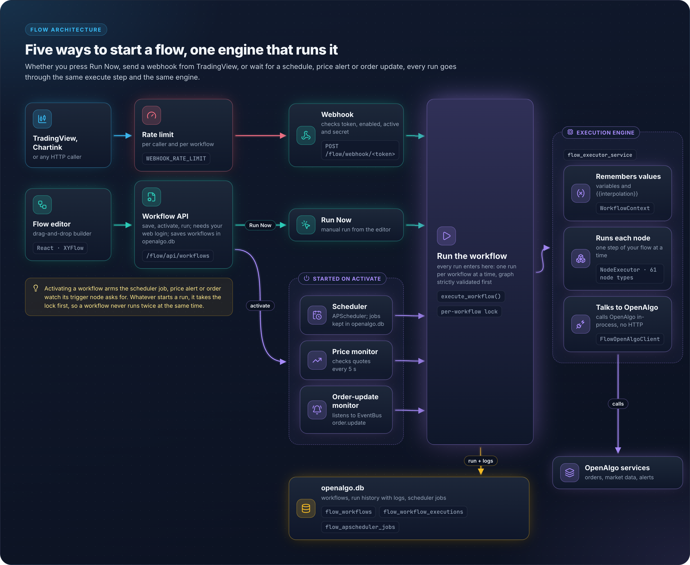
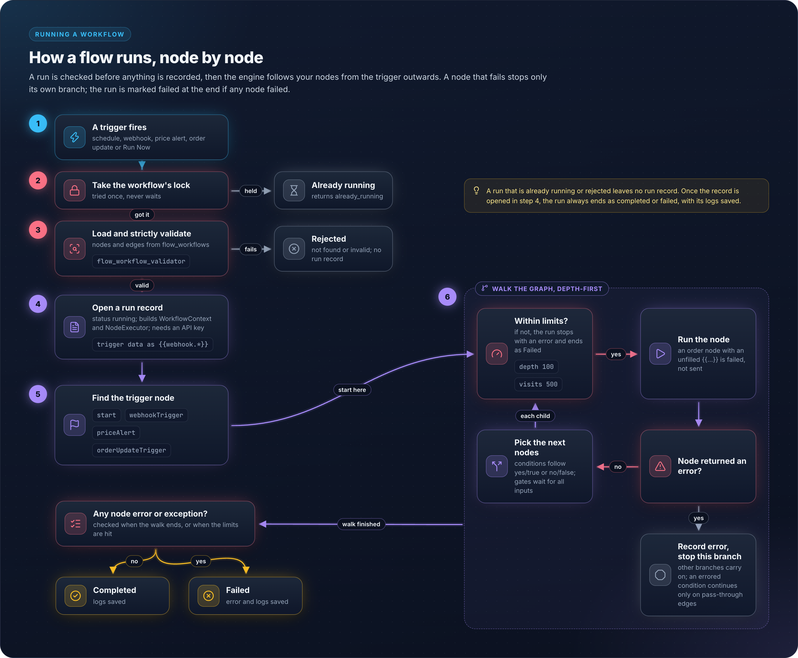
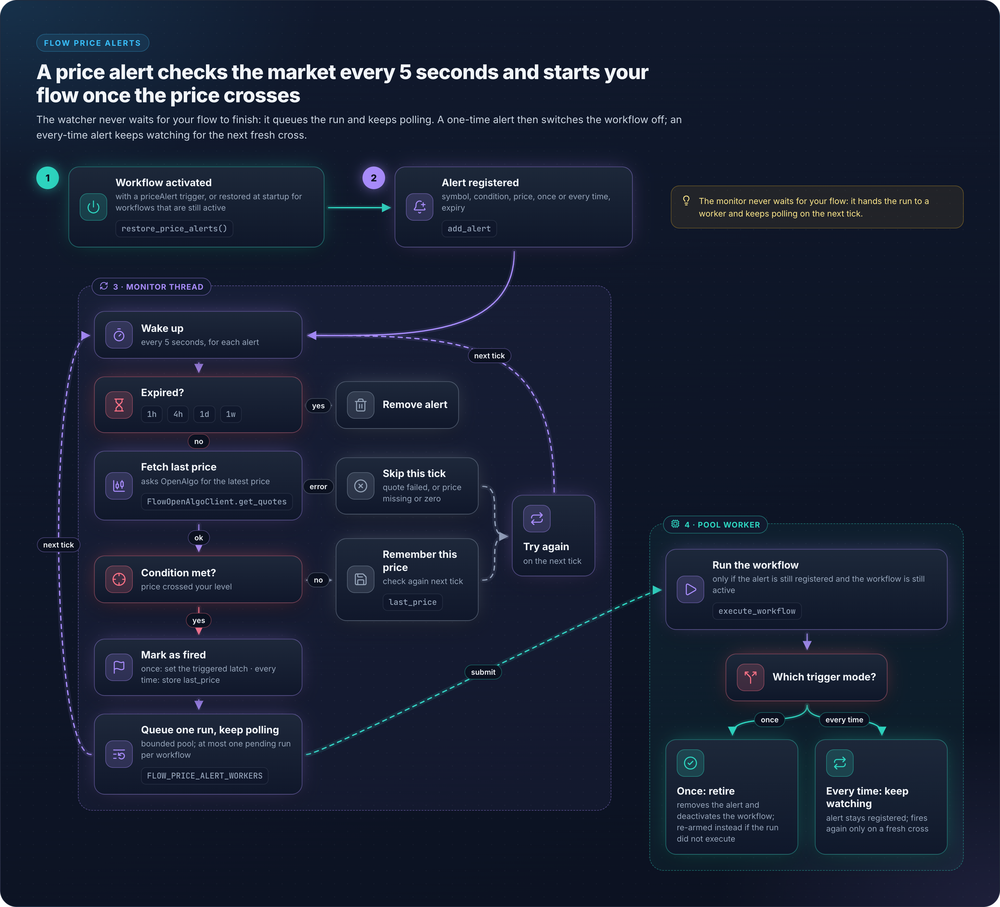

# 10 - Flow Architecture

## Overview

Flow is OpenAlgo's visual workflow automation system built with XYFlow (React Flow). It enables users to create trading strategies as visual node graphs without coding, supporting scheduled execution, webhook triggers, and price alerts.

## Architecture Diagram

<figure><figcaption></figcaption></figure>

## Node Types

`services/flow_executor_service.py` dispatches 61 node types. Each has a matching React component under `frontend/src/components/flow/nodes/`. The `type` values below are the exact strings stored in the workflow's `nodes` JSON.

### Trigger Nodes

| Node type | Description | Configuration |
|-----------|-------------|---------------|
| `start` | Scheduled trigger | scheduleType, time, days, intervalValue, intervalUnit, executeAt |
| `webhookTrigger` | External HTTP trigger | symbol, exchange (optional) |
| `priceAlert` | Price condition trigger | symbol, condition, price, percentage |
| `orderUpdateTrigger` | Broker order-update trigger | filters on the order update event |

### Order Execution Nodes

| Node type | Description | Configuration |
|-----------|-------------|---------------|
| `placeOrder` | Single order | symbol, exchange, action, quantity, priceType, product |
| `smartOrder` | Position-aware order | Same + positionSize |
| `optionsOrder` | Single options leg | underlying, expiry, offset, optionType |
| `optionsMultiOrder` | Multi-leg options order | underlying, legs |
| `modifyOrder` | Modify existing | orderId, updated fields |
| `cancelOrder` | Cancel single order | orderId |
| `cancelAllOrders` | Cancel all open | - |
| `closePositions` | Close position | symbol, exchange, product |
| `basketOrder` | Multiple orders | orders (CSV or array) |
| `splitOrder` | Chunked order | symbol, quantity, splitSize |

An order node whose order-defining fields still contain an unresolved `{{...}}` reference is failed rather than sent to the broker. The guarded set is `ORDER_NODE_TYPES` in `flow_executor_service.py`.

### Market Data Nodes

| Node type | Description | Returns |
|-----------|-------------|---------|
| `getQuote` | Real-time quote | ltp, open, high, low, close, volume |
| `getDepth` | Order book | bids, asks, totalbuyqty, totalsellqty |
| `multiQuotes` | Quotes for several symbols | Array of quotes |
| `history` | OHLCV data | Array of candles |
| `priorPeriodOhlc` | Previous period OHLC | open, high, low, close |
| `barOffset` | Value from an earlier bar | Single bar's fields |
| `indicator` | Technical indicator | Indicator series or latest value |
| `intervals` | Supported history intervals | Array of intervals |
| `getOrderStatus` | Status of one order | Order status fields |
| `openPosition` | Position for symbol | quantity, avgprice, pnl |
| `optionChain` | Options data | calls, puts, spot_price |
| `optionSymbol` | Resolve an option symbol | Symbol string |
| `symbol` | Resolve a symbol | Symbol metadata |
| `expiry` | Expiry dates | Array of expiries |
| `syntheticFuture` | Synthetic future price | Computed price |
| `strategyPnl` | P&L for a strategy | P&L fields |
| `orderBook` | All orders | Array of orders |
| `tradeBook` | All trades | Array of trades |
| `positionBook` | All positions | Array of positions |
| `holdings` | Delivery holdings | Array of holdings |
| `funds` | Account balance | availablecash, marginused |
| `margin` | Margin requirement | Margin fields |
| `calendar` | Market calendar | Calendar data |
| `holidays` | Market holidays | Array of holidays |
| `timings` | Market timings | Session times |

### Condition Nodes

| Node type | Description | Output Handles |
|-----------|-------------|----------------|
| `priceCondition` | Compare price | yes / no |
| `varCondition` | Compare a workflow variable | yes / no |
| `positionCheck` | Check position qty | yes / no |
| `fundCheck` | Check available funds | yes / no |
| `timeWindow` | Check time range | yes / no |
| `timeCondition` | Compare with target time | yes / no |
| `andGate` | Logical AND | single output |
| `orGate` | Logical OR | single output |
| `notGate` | Logical NOT | single output |

Gates wait until every wired input has been evaluated before firing, and produce exactly one result per run. This is what prevents an `A AND B` gate from firing on `A` alone and then firing a second time for `B`.

### Streaming Nodes

| Node type | Description | Behavior |
|-----------|-------------|----------|
| `subscribeLtp` | Real-time LTP | WebSocket, REST fallback |
| `subscribeQuote` | Real-time quote | WebSocket mode 2 |
| `subscribeDepth` | Real-time depth | WebSocket mode 3 |
| `unsubscribe` | Stop streaming | Cleanup subscription |

### Utility Nodes

| Node type | Description |
|-----------|-------------|
| `variable` | Set/get/arithmetic operations |
| `mathExpression` | Evaluate an arithmetic expression |
| `log` | Debug logging |
| `delay` | Wait for duration, capped at `DELAY_MAX_SECONDS = 300` |
| `waitUntil` | Wait until time |
| `httpRequest` | External API call, timeout capped at `HTTP_TIMEOUT_MAX_MS = 60000` |
| `telegramAlert` | Send Telegram notification |
| `whatsappAlert` | Send WhatsApp notification |
| `group` | Container node for grouping other nodes |

## Database Schema

**Location:** `database/flow_db.py`

### FlowWorkflow Table

Model `FlowWorkflow`, `__tablename__ = 'flow_workflows'`.

```sql
CREATE TABLE flow_workflows (
    id                INTEGER PRIMARY KEY,
    name              VARCHAR(255) NOT NULL,
    description       TEXT,
    nodes             JSON DEFAULT [],      -- React Flow nodes
    edges             JSON DEFAULT [],      -- React Flow edges
    is_active         BOOLEAN DEFAULT FALSE,
    schedule_job_id   VARCHAR(255),         -- APScheduler job ID
    webhook_token     VARCHAR(64) UNIQUE,   -- URL-safe token, generated on insert
    webhook_secret    VARCHAR(64),          -- Generated on insert
    webhook_enabled   BOOLEAN DEFAULT FALSE,
    webhook_auth_type VARCHAR(20) DEFAULT 'payload',  -- 'payload' or 'url'
    api_key           VARCHAR(255),         -- Stored on activation
    created_at        DATETIME,             -- server_default now()
    updated_at        DATETIME              -- server_default now(), onupdate now()
);
```

`webhook_token` and `webhook_secret` are populated by the column defaults `generate_webhook_token()` and `generate_webhook_secret()`, so every row gets a webhook identity whether or not the webhook is enabled.

### FlowWorkflowExecution Table

Model `FlowWorkflowExecution`, `__tablename__ = 'flow_workflow_executions'`.

```sql
CREATE TABLE flow_workflow_executions (
    id           INTEGER PRIMARY KEY,
    workflow_id  INTEGER NOT NULL REFERENCES flow_workflows(id),
    status       VARCHAR(50) DEFAULT 'pending',  -- pending, running, completed, failed
    started_at   DATETIME,
    completed_at DATETIME,
    logs         JSON DEFAULT [],
    error        TEXT
);
```

## Execution Engine

**Location:** `services/flow_executor_service.py`

### Execution Flow

<figure><figcaption></figcaption></figure>

### Safety Limits

```python
MAX_NODE_DEPTH = 100      # Maximum nesting depth
MAX_NODE_VISITS = 500     # Maximum total node visits

# Per-workflow mutex (prevent concurrent execution of the same workflow).
# Held weakly so a deleted workflow's lock is collected rather than leaked.
_workflow_locks: "weakref.WeakValueDictionary[int, threading.Lock]" = weakref.WeakValueDictionary()
_locks_mutex = threading.Lock()
```

Exceeding either limit raises `Maximum node depth (100) exceeded` or `Maximum node visits (500) exceeded` and fails the execution.

### WorkflowContext

Manages variables and interpolation during execution:

```python
class WorkflowContext:
    variables: Dict[str, Any]           # User variables
    condition_results: Dict[str, bool]  # Condition outcomes

    def interpolate(text: str) -> str:
        # Replace {{var}} patterns with values
```

### Built-in Variables

Available in any text field via `{{variable}}` syntax:

| Variable | Example Output |
|----------|----------------|
| `{{timestamp}}` | 2024-01-15 14:30:45 |
| `{{iso_timestamp}}` | 2024-01-15T14:30:45 |
| `{{date}}` | 2024-01-15 |
| `{{session_date}}` | 2024-01-15 (trading session date, differs from `date` between midnight and the 03:00 IST rollover) |
| `{{time}}` | 14:30:45 |
| `{{year}}` / `{{month}}` / `{{day}}` | 2024 / 01 / 15 |
| `{{hour}}` / `{{minute}}` / `{{second}}` | 14 / 30 / 45 |
| `{{weekday}}` | Monday |
| `{{weekday_num}}` | 1 (ISO weekday, Monday is 1) |
| `{{quarter}}` | 1 |
| `{{week_of_year}}` | 3 |
| `{{day_of_year}}` | 15 |
| `{{webhook.field}}` | Webhook payload data |

## Webhook System

### Webhook URLs

```
POST /flow/webhook/{token}
POST /flow/webhook/{token}/{symbol}
```

### Authentication Methods

**Payload Authentication (default):**
```json
POST /flow/webhook/abc123
{
  "secret": "your_webhook_secret",
  "symbol": "NSE:SBIN-EQ",
  "price": 500.50
}
```

**URL Parameter Authentication:**
```
POST /flow/webhook/abc123?secret=your_webhook_secret
```

The auth type is per workflow (`webhook_auth_type`, default `payload`) and is switched through `/flow/api/workflows/{id}/webhook/auth-type`. Both comparisons use `hmac.compare_digest`. In payload mode the `secret` field is popped out of the body before the workflow sees it. The webhook returns 404 for an unknown token, 403 when the webhook is disabled or the workflow is inactive, and 401 for a missing or wrong secret.

The API key used for execution is resolved in order: the workflow's own `api_key` stored at activation (decrypted by `get_workflow_api_key()`), then the session key, then `OPENALGO_API_KEY` from the environment. With none of the three, the call fails with HTTP 500 asking the user to re-activate the workflow.

### TradingView Integration

```json
// Webhook URL: https://your-domain/flow/webhook/{token}
{
  "secret": "your_secret",
  "symbol": "{{ticker}}",
  "action": "{{strategy.order.action}}",
  "price": "{{close}}"
}
```

## Scheduling System

**Location:** `services/flow_scheduler_service.py`

Uses APScheduler with a SQLAlchemy job store for persistence. The table name is `FLOW_JOBSTORE_TABLE = "flow_apscheduler_jobs"`, defined in `database/apscheduler_jobstore_db.py`.

### Schedule Types

| Type | Configuration | Trigger |
|------|---------------|---------|
| manual | - | No job is scheduled. A missing `scheduleType` is treated the same way |
| daily | time: "09:15" | `CronTrigger(hour, minute)` |
| weekly | time, days: [1,3,5] | `CronTrigger(day_of_week, hour, minute)` |
| interval | value: 5, unit: "minutes" | `IntervalTrigger`. `unit` accepts `seconds`, `minutes` or `hours`, defaulting to `minutes`, and `value` defaults to 1 |
| once | executeAt: ISO datetime | `DateTrigger(run_date)` |

Any other combination raises `Invalid schedule configuration`.

### Cron Examples

```python
# Daily at 09:15
CronTrigger(hour=9, minute=15)

# Mon-Fri at 14:30
CronTrigger(day_of_week="mon-fri", hour=14, minute=30)

# Every 5 minutes
IntervalTrigger(minutes=5)
```

## Price Monitoring

**Location:** `services/flow_price_monitor_service.py`

Polling-based monitor for price alert triggers.

### Alert Conditions

| Condition | Description |
|-----------|-------------|
| greater_than | LTP > target |
| less_than | LTP < target |
| crossing | Price within 0.1 percent of target |
| crossing_up | Previous price at or below target and current price above it |
| crossing_down | Previous price at or above target and current price below it |
| entering_channel / inside_channel | Price inside [price_lower, price_upper] |
| exiting_channel / outside_channel | Price outside [price_lower, price_upper] |
| moving_up | Price higher than the previous poll |
| moving_down | Price lower than the previous poll |
| moving_up_percent | Percent increase since the previous poll reaches the configured percentage |
| moving_down_percent | Percent decrease since the previous poll reaches the configured percentage |

An unrecognized condition is logged as an error rather than silently evaluating to false.

### Monitor Lifecycle

<figure><figcaption></figcaption></figure>

## API Endpoints

Blueprint: `flow`, `url_prefix="/flow"`. No route in this blueprint carries a `@limiter.limit` decorator.

### Workflow Management

| Endpoint | Method | Description |
|----------|--------|-------------|
| `/flow/api/workflows` | GET | List all workflows |
| `/flow/api/workflows` | POST | Create workflow |
| `/flow/api/workflows/{id}` | GET/PUT/DELETE | CRUD operations |
| `/flow/api/workflows/{id}/activate` | POST | Activate workflow |
| `/flow/api/workflows/{id}/deactivate` | POST | Deactivate workflow |
| `/flow/api/workflows/{id}/execute` | POST | Manual execute |
| `/flow/api/workflows/{id}/executions` | GET | Execution history |
| `/flow/api/workflows/{id}/export` | GET | Export workflow as JSON |
| `/flow/api/workflows/import` | POST | Import a workflow as a new record |
| `/flow/api/workflows/{id}/replace` | POST | Replace an existing workflow's graph |

### Webhook Management

| Endpoint | Method | Description |
|----------|--------|-------------|
| `/flow/api/workflows/{id}/webhook` | GET | Get webhook config |
| `/flow/api/workflows/{id}/webhook/enable` | POST | Enable webhook |
| `/flow/api/workflows/{id}/webhook/disable` | POST | Disable webhook |
| `/flow/api/workflows/{id}/webhook/regenerate` | POST | New token and secret |
| `/flow/api/workflows/{id}/webhook/regenerate-secret` | POST | New secret only, token unchanged |
| `/flow/api/workflows/{id}/webhook/auth-type` | POST | Switch between `payload` and `url` auth |

### Public Webhook

| Endpoint | Method | Description |
|----------|--------|-------------|
| `/flow/webhook/{token}` | POST | Trigger workflow |
| `/flow/webhook/{token}/{symbol}` | POST | Trigger with symbol |

### Helper Endpoints

| Endpoint | Method | Description |
|----------|--------|-------------|
| `/flow/api/monitor/status` | GET | Price monitor status (tracked alerts, poll interval) |
| `/flow/api/index-symbols` | GET | Index symbol list for node dropdowns |
| `/flow/api/symbol-lotsizes` | POST | Lot sizes for a batch of symbols |

## Key Files Reference

| File | Purpose |
|------|---------|
| `blueprints/flow.py` | Flow API endpoints and webhook handler |
| `database/flow_db.py` | Database models (FlowWorkflow, FlowWorkflowExecution) |
| `services/flow_executor_service.py` | Execution engine (WorkflowContext, NodeExecutor) |
| `services/flow_scheduler_service.py` | APScheduler integration |
| `services/flow_price_monitor_service.py` | Price alert monitoring |
| `services/flow_openalgo_client.py` | OpenAlgo API client wrapper |
| `frontend/src/pages/flow/FlowIndex.tsx` | Workflow list UI |
| `frontend/src/pages/flow/FlowEditor.tsx` | Visual editor (XYFlow) |
| `frontend/src/components/flow/nodes/` | Custom node components |
| `frontend/src/components/flow/panels/` | ConfigPanel, ExecutionLogPanel |
