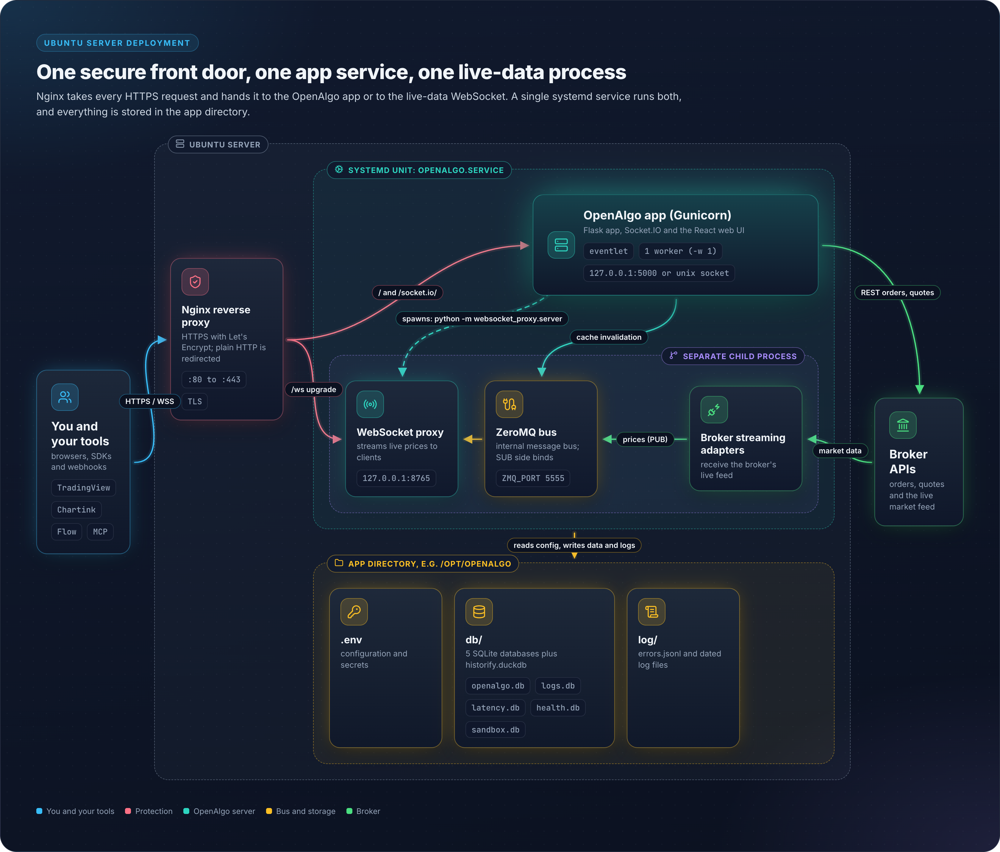

# 12 - Ubuntu Server Installation

## Overview

This guide covers deploying OpenAlgo on an Ubuntu server (22.04 or 24.04 LTS) with an Nginx reverse proxy, a systemd service, and SSL for production use. `pyproject.toml` sets `requires-python = ">=3.12"`, so Python 3.12 or newer is mandatory. The steps below are the manual equivalent of `install/install.sh`, which automates the same work and additionally offers Remote MCP setup.

## Architecture Diagram

<figure><figcaption></figcaption></figure>

## Prerequisites

```bash
# Update system
sudo apt update && sudo apt upgrade -y

# Install required packages
sudo apt install -y python3.12 python3.12-venv python3-pip \
                    nginx certbot python3-certbot-nginx \
                    git curl build-essential

# Install Node.js (for frontend build)
# frontend/package.json requires Node >=20.20, >=22.22 or >=24.13
curl -fsSL https://deb.nodesource.com/setup_22.x | sudo -E bash -
sudo apt install -y nodejs
```

## Installation Steps

### 1. Clone Repository

```bash
# Create application directory
sudo mkdir -p /opt/openalgo
sudo chown $USER:$USER /opt/openalgo

# Clone repository
cd /opt/openalgo
git clone https://github.com/marketcalls/openalgo.git .
```

### 2. Setup Python Environment

```bash
# Install uv package manager
pip install uv

# Create virtual environment and install dependencies
uv venv .venv
source .venv/bin/activate
uv sync

# Install production dependencies (same pin the install script uses)
uv pip install "gunicorn>=25.0,<26" eventlet
```

### 3. Configure Environment

```bash
# Copy sample environment file
cp .sample.env .env

# Generate secure keys
python -c "import secrets; print(secrets.token_hex(32))"
# Copy output to APP_KEY and API_KEY_PEPPER in .env

# Edit configuration
nano .env
```

### 4. Build Frontend

```bash
cd frontend
npm install
npm run build
cd ..
```

### 5. Create Systemd Service

**Note:** One systemd service is sufficient. Under Gunicorn/eventlet, `websocket_proxy.app_integration` spawns the WebSocket proxy as an isolated child process on port 8765; it is not an in-process daemon thread.

```bash
sudo nano /etc/systemd/system/openalgo.service
```

```ini
[Unit]
Description=OpenAlgo Trading Platform
After=network.target

[Service]
Type=simple
User=www-data
Group=www-data
WorkingDirectory=/opt/openalgo
Environment="PATH=/opt/openalgo/.venv/bin"
# Keep numerical libraries from spawning a thread per core under systemd
Environment="OPENBLAS_NUM_THREADS=2"
Environment="OMP_NUM_THREADS=2"
Environment="MKL_NUM_THREADS=2"
Environment="NUMEXPR_NUM_THREADS=2"
Environment="NUMBA_NUM_THREADS=2"
ExecStart=/opt/openalgo/.venv/bin/gunicorn \
    --worker-class eventlet \
    -w 1 \
    --bind 127.0.0.1:5000 \
    --timeout 300 \
    --log-level info \
    app:app
Restart=always
RestartSec=5
TimeoutSec=300

[Install]
WantedBy=multi-user.target
```

**Important:** Use `-w 1` (single worker) for WebSocket compatibility.

The bundled `install/install.sh` binds gunicorn to a unix socket under `/run` instead of `127.0.0.1:5000` and points the Nginx upstream at that socket. Either binding works; keep the systemd unit and the Nginx `proxy_pass` consistent with whichever you choose.

### 6. Set Permissions

```bash
# Set ownership
sudo chown -R www-data:www-data /opt/openalgo

# Set permissions
sudo chmod -R 755 /opt/openalgo
sudo chmod 700 /opt/openalgo/keys
sudo chmod 600 /opt/openalgo/.env
```

### 7. Configure Nginx

```bash
sudo nano /etc/nginx/sites-available/openalgo
```

```nginx
server {
    listen 80;
    server_name your-domain.com;

    # Redirect HTTP to HTTPS
    return 301 https://$server_name$request_uri;
}

server {
    listen 443 ssl http2;
    server_name your-domain.com;

    # SSL certificates (Let's Encrypt)
    ssl_certificate /etc/letsencrypt/live/your-domain.com/fullchain.pem;
    ssl_certificate_key /etc/letsencrypt/live/your-domain.com/privkey.pem;

    # SSL configuration
    ssl_protocols TLSv1.2 TLSv1.3;
    ssl_prefer_server_ciphers on;
    ssl_ciphers ECDHE-ECDSA-AES128-GCM-SHA256:ECDHE-RSA-AES128-GCM-SHA256;

    # Main application
    location / {
        proxy_pass http://127.0.0.1:5000;
        proxy_http_version 1.1;
        proxy_set_header Host $host;
        proxy_set_header X-Real-IP $remote_addr;
        proxy_set_header X-Forwarded-For $proxy_add_x_forwarded_for;
        proxy_set_header X-Forwarded-Proto $scheme;

        # WebSocket support for Socket.IO
        proxy_set_header Upgrade $http_upgrade;
        proxy_set_header Connection "upgrade";
        proxy_read_timeout 86400;
    }

    # WebSocket proxy
    location /ws {
        proxy_pass http://127.0.0.1:8765;
        proxy_http_version 1.1;
        proxy_set_header Upgrade $http_upgrade;
        proxy_set_header Connection "upgrade";
        proxy_set_header Host $host;
        proxy_read_timeout 86400;
    }
}
```

### 8. Enable Service

```bash
# Enable Nginx site
sudo ln -s /etc/nginx/sites-available/openalgo /etc/nginx/sites-enabled/
sudo nginx -t
sudo systemctl restart nginx

# Enable and start OpenAlgo service
sudo systemctl daemon-reload
sudo systemctl enable openalgo
sudo systemctl start openalgo
```

### 9. Setup SSL (Let's Encrypt)

```bash
sudo certbot --nginx -d your-domain.com
```

## Service Management

```bash
# Check status
sudo systemctl status openalgo

# View logs
sudo journalctl -u openalgo -f

# Restart service
sudo systemctl restart openalgo

# Stop service
sudo systemctl stop openalgo
```

## Firewall Configuration

```bash
# Enable firewall
sudo ufw enable

# Allow required ports
sudo ufw allow 22/tcp     # SSH
sudo ufw allow 80/tcp     # HTTP
sudo ufw allow 443/tcp    # HTTPS

# Check status
sudo ufw status
```

## Update Procedure

```bash
# Stop service
sudo systemctl stop openalgo

# Pull updates
cd /opt/openalgo
git pull origin main

# Update dependencies
source .venv/bin/activate
uv sync

# Rebuild frontend
cd frontend
npm install
npm run build
cd ..

# Start service
sudo systemctl start openalgo
```

## Troubleshooting

| Issue | Solution |
|-------|----------|
| 502 Bad Gateway | Check if OpenAlgo service is running: `systemctl status openalgo` |
| WebSocket fails | Check Nginx /ws proxy config and service logs |
| Permission denied | Verify www-data ownership: `chown -R www-data:www-data /opt/openalgo` |
| SSL error | Renew certificates: `sudo certbot renew` |

## Key Files Reference

| File | Purpose |
|------|---------|
| `/etc/systemd/system/openalgo.service` | Main service (includes WebSocket) |
| `/etc/nginx/sites-available/openalgo` | Nginx config |
| `/opt/openalgo/.env` | Application config |
| `/var/log/nginx/` | Nginx logs |

**Note:** There is no separate `openalgo-ws.service`. The Gunicorn-managed application starts the WebSocket proxy as a child process on port 8765, and systemd's service cgroup owns both processes.
