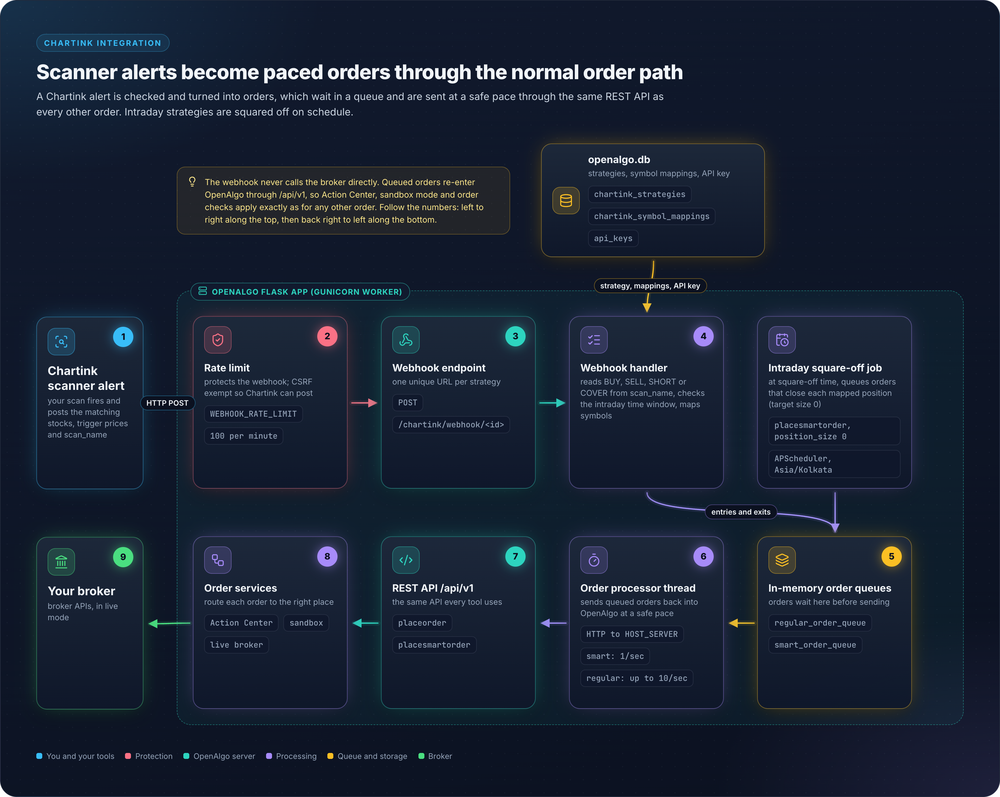
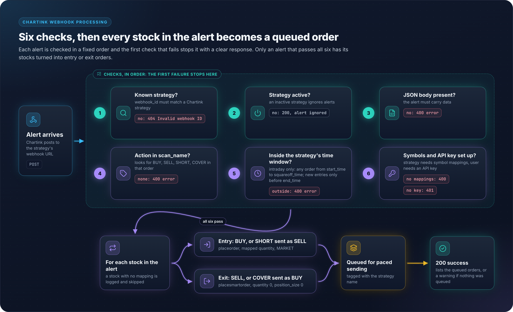

# 13 - Chartink Architecture

## Overview

Chartink integration allows OpenAlgo to receive trading signals from Chartink screener alerts via webhooks. When a stock appears in a Chartink scanner, it triggers a webhook that OpenAlgo processes to place trades automatically.

> **Note**: The Chartink integration uses a "Strategy" concept (not "Scanner") where each strategy has symbol-level configuration with time-based trading controls.

## Architecture Diagram

<figure><figcaption></figcaption></figure>

## Database Schema

**Location:** `database/chartink_db.py`

```python
class ChartinkStrategy(Base):
    """Model for Chartink strategies - each strategy has time-based trading controls"""
    __tablename__ = 'chartink_strategies'

    id = Column(Integer, primary_key=True)
    name = Column(String(255), nullable=False)           # Strategy name
    webhook_id = Column(String(36), unique=True, nullable=False)  # UUID for webhook
    user_id = Column(String(255), nullable=False)        # Owner
    is_active = Column(Boolean, default=True)            # Enable/disable
    is_intraday = Column(Boolean, default=True)          # Intraday mode flag
    start_time = Column(String(5))                       # Trading start (HH:MM format)
    end_time = Column(String(5))                         # Trading end (HH:MM format)
    squareoff_time = Column(String(5))                   # Auto square-off time (HH:MM)
    created_at = Column(DateTime(timezone=True), server_default=func.now())
    updated_at = Column(DateTime(timezone=True), onupdate=func.now())

    # Relationships
    symbol_mappings = relationship("ChartinkSymbolMapping", back_populates="strategy",
                                   cascade="all, delete-orphan")


class ChartinkSymbolMapping(Base):
    """Symbol-level configuration - maps Chartink symbols to trading parameters"""
    __tablename__ = 'chartink_symbol_mappings'

    id = Column(Integer, primary_key=True)
    strategy_id = Column(Integer, ForeignKey('chartink_strategies.id'), nullable=False)
    chartink_symbol = Column(String(50), nullable=False)  # Symbol from Chartink
    exchange = Column(String(10), nullable=False)         # NSE/BSE
    quantity = Column(Integer, nullable=False)            # Order quantity
    product_type = Column(String(10), nullable=False)     # MIS/CNC
    created_at = Column(DateTime(timezone=True), server_default=func.now())
    updated_at = Column(DateTime(timezone=True), onupdate=func.now())

    # Relationships
    strategy = relationship("ChartinkStrategy", back_populates="symbol_mappings")
```

> **Key Differences from Scanner Model**: The strategy model does NOT have `action` (BUY/SELL), `default_quantity`, or scanner-level `exchange`/`product_type`. Instead, trading parameters are defined per-symbol in the mapping table.

## Webhook Configuration

### Chartink Setup

1. Go to Chartink Scanner
2. Edit scanner settings
3. Add webhook URL: `http://your-domain/chartink/webhook/<webhook_id>` (the webhook ID is part of the URL path, not the body)
4. Chartink posts its standard alert body. OpenAlgo reads three fields from it:

```json
{
    "stocks": "SBIN,RELIANCE,INFY",
    "trigger_prices": "625.5,2450.1,1650.0",
    "scan_name": "My BUY Scan"
}
```

> **Important**: The action is derived from the keyword in `scan_name`. `BUY` and `SHORT` are entry orders sent to `placeorder` with the mapped quantity. `SELL` and `COVER` are exit orders sent to `placesmartorder` with `quantity=0` and `position_size=0`. A scan name containing none of these four keywords is rejected with HTTP 400.

### OpenAlgo Setup

1. Navigate to `/chartink`
2. Create new strategy. The name is automatically prefixed with `chartink_` if it does not already start with it.
3. Copy the generated `webhook_id`
4. Configure time-based trading controls (required when the strategy type is intraday):
   - **Start Time**: When to start accepting signals (HH:MM)
   - **End Time**: When to stop accepting entry signals (HH:MM)
   - **Square-off Time**: Auto close positions (HH:MM)
   - **Intraday Mode**: Enable for MIS trades

5. Add symbol mappings with per-symbol configuration:
   - **Chartink Symbol**: Symbol as sent by Chartink
   - **Exchange**: NSE or BSE only
   - **Product Type**: MIS or CNC only
   - **Quantity**: Order quantity for this symbol

## Symbol Mapping

Each symbol in a strategy has its own trading configuration:

| Chartink Symbol | Exchange | Product | Quantity |
|-----------------|----------|---------|----------|
| SBIN | NSE | MIS | 100 |
| RELIANCE | NSE | CNC | 10 |
| INFY | NSE | MIS | 50 |

> **Note**: Unlike scanner-level defaults, each symbol must have its exchange, product, and quantity explicitly configured in the symbol mapping. There are no fallback defaults: a symbol arriving in the webhook with no mapping is logged and skipped, and a strategy with no mappings at all rejects the webhook with HTTP 400.

## Processing Flow

<figure><figcaption></figcaption></figure>

## API Endpoints

Blueprint: `chartink_bp`, `url_prefix="/chartink"`.

| Endpoint | Method | Description |
|----------|--------|-------------|
| `/chartink/webhook/<webhook_id>` | POST | Receive Chartink alerts |
| `/chartink/` | GET | List strategies |
| `/chartink/new` | GET/POST | Create strategy |
| `/chartink/<strategy_id>` | GET | View strategy |
| `/chartink/<strategy_id>/delete` | POST | Delete strategy |
| `/chartink/<strategy_id>/toggle` | POST | Enable/disable strategy |
| `/chartink/<strategy_id>/configure` | GET/POST | Add symbol mappings (single or bulk) |
| `/chartink/<strategy_id>/symbol/<mapping_id>/delete` | POST | Delete one symbol mapping |
| `/chartink/search` | GET | Symbol search helper |
| `/chartink/api/strategies` | GET | List strategies as JSON |
| `/chartink/api/strategy/<strategy_id>` | GET | Strategy details as JSON |
| `/chartink/api/strategy` | POST | Create strategy as JSON |
| `/chartink/api/strategy/<strategy_id>/toggle` | POST | Toggle strategy as JSON |

Rate limits actually applied: `WEBHOOK_RATE_LIMIT` on the webhook route only. `STRATEGY_RATE_LIMIT` on `/new`, `/<strategy_id>/delete`, `/<strategy_id>/configure`, `/<strategy_id>/symbol/<mapping_id>/delete` and `/api/strategy`. The remaining routes carry no `@limiter.limit` decorator.

## Database Functions

**Strategy Management:**
- `create_strategy(name, webhook_id, user_id, is_intraday, start_time, end_time, squareoff_time)`
- `get_strategy(strategy_id)` - Get strategy by ID
- `get_strategy_by_webhook_id(webhook_id)` - Get strategy by webhook ID
- `get_user_strategies(user_id)` - Get all strategies for a user
- `get_all_strategies()` - Get all strategies
- `delete_strategy(strategy_id)` - Delete a strategy
- `toggle_strategy(strategy_id)` - Toggle active status
- `update_strategy_times(strategy_id, start_time, end_time, squareoff_time)` - Update trading times

**Symbol Mapping Management:**
- `add_symbol_mapping(strategy_id, chartink_symbol, exchange, quantity, product_type)`
- `bulk_add_symbol_mappings(strategy_id, mappings)` - Add multiple mappings at once
- `get_symbol_mappings(strategy_id)` - Get all mappings for a strategy
- `delete_symbol_mapping(mapping_id)` - Delete a mapping

## Webhook Payload Format

### From Chartink

Posted to `/chartink/webhook/abc123-def456-ghi789`:

```json
{
    "stocks": "SBIN,RELIANCE,INFY,TATAMOTORS",
    "trigger_prices": "625.5,2450.1,1650.0,720.4",
    "scan_name": "Momentum BUY Scan"
}
```

### Processed Order (entry, BUY or SHORT)

Queued to `/api/v1/placeorder`:

```json
{
    "apikey": "user_api_key",
    "strategy": "chartink_momentum",
    "symbol": "SBIN",
    "exchange": "NSE",
    "action": "BUY",
    "product": "MIS",
    "pricetype": "MARKET",
    "quantity": "100"
}
```

### Processed Order (exit, SELL or COVER)

Queued to `/api/v1/placesmartorder`:

```json
{
    "apikey": "user_api_key",
    "strategy": "chartink_momentum",
    "symbol": "SBIN",
    "exchange": "NSE",
    "action": "SELL",
    "product": "MIS",
    "pricetype": "MARKET",
    "quantity": "0",
    "position_size": "0",
    "price": "0",
    "trigger_price": "0",
    "disclosed_quantity": "0"
}
```

## Configuration

### Environment Variables

Defaults as written in `blueprints/chartink.py`:

```bash
WEBHOOK_RATE_LIMIT="100 per minute"
STRATEGY_RATE_LIMIT="200 per minute"
HOST_SERVER="http://127.0.0.1:5000"
```

`HOST_SERVER` is the base URL the queued orders are posted back to.

### Strategy Settings

| Setting | Description | Default |
|---------|-------------|---------|
| `name` | Strategy name | Required |
| `webhook_id` | UUID for webhook | Auto-generated |
| `user_id` | Owner user ID | Current user |
| `is_active` | Enable/disable strategy | true |
| `is_intraday` | Intraday trading mode | true |
| `start_time` | Trading window start (HH:MM) | None |
| `end_time` | Trading window end (HH:MM) | None |
| `squareoff_time` | Auto square-off time (HH:MM) | None |

### Symbol Mapping Settings

| Setting | Description | Required |
|---------|-------------|----------|
| `chartink_symbol` | Symbol from Chartink | Yes |
| `exchange` | Trading exchange (NSE or BSE only) | Yes |
| `quantity` | Order quantity (must be greater than 0) | Yes |
| `product_type` | Product type (MIS or CNC only) | Yes |

## Use Cases

### Momentum Scanner

```
Chartink: Stocks crossing 20 DMA with volume spike
OpenAlgo: Auto-buy with MIS product, qty=100
```

### Breakout Scanner

```
Chartink: Stocks breaking 52-week high
OpenAlgo: Auto-buy with CNC product for delivery
```

### Exit Scanner

```
Chartink: Stocks falling below support
OpenAlgo: Auto-sell to close positions
```

## Key Files Reference

| File | Purpose |
|------|---------|
| `blueprints/chartink.py` | Chartink blueprint |
| `database/chartink_db.py` | Database models |
| `frontend/src/pages/chartink/ChartinkIndex.tsx` | Strategy list UI |
| `frontend/src/pages/chartink/NewChartinkStrategy.tsx` | Creation UI |
| `frontend/src/pages/chartink/ViewChartinkStrategy.tsx` | Detail UI |
| `frontend/src/pages/chartink/ConfigureChartinkSymbols.tsx` | Symbol mapping UI |
