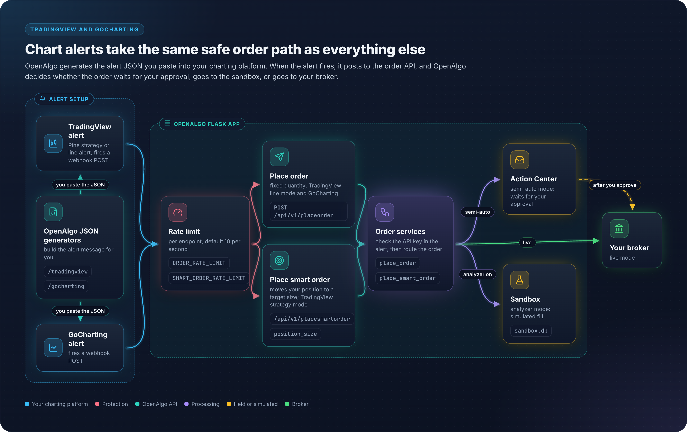

# 14 - TradingView & GoCharting

## Overview

OpenAlgo integrates with TradingView and GoCharting platforms to receive trading signals via webhooks. These charting platforms can trigger automated trades when alert conditions are met.

## Architecture Diagram

<figure><figcaption></figcaption></figure>

## TradingView Webhook Setup

### Webhook URL

```
http://your-domain.com/api/v1/placeorder
```

### Alert Message Format

```json
{
    "apikey": "your_openalgo_api_key",
    "symbol": "{{ticker}}",
    "exchange": "NSE",
    "action": "{{strategy.order.action}}",
    "quantity": {{strategy.order.contracts}},
    "product": "MIS",
    "pricetype": "MARKET"
}
```

### Pine Script Variables

| Variable | Description | Example |
|----------|-------------|---------|
| `{{ticker}}` | Trading symbol | SBIN |
| `{{strategy.order.action}}` | BUY or SELL | BUY |
| `{{strategy.order.contracts}}` | Order quantity | 100 |
| `{{close}}` | Closing price | 625.50 |
| `{{time}}` | Alert time | 2024-01-15T09:30:00 |

## Symbol Format Examples

### Equity

```json
{
    "apikey": "your_api_key",
    "symbol": "SBIN",
    "exchange": "NSE",
    "action": "BUY",
    "quantity": 100,
    "product": "MIS",
    "pricetype": "MARKET"
}
```

### Index Futures (NFO - Expires Tuesday)

```json
{
    "apikey": "your_api_key",
    "symbol": "NIFTY21JAN25FUT",
    "exchange": "NFO",
    "action": "BUY",
    "quantity": 65,
    "product": "MIS",
    "pricetype": "MARKET"
}
```

### Index Options (NFO - Expires Tuesday)

```json
{
    "apikey": "your_api_key",
    "symbol": "NIFTY21JAN2521500CE",
    "exchange": "NFO",
    "action": "BUY",
    "quantity": 65,
    "product": "MIS",
    "pricetype": "MARKET"
}
```

### Bank Nifty Options (NFO - Expires Tuesday)

```json
{
    "apikey": "your_api_key",
    "symbol": "BANKNIFTY21JAN2548000CE",
    "exchange": "NFO",
    "action": "BUY",
    "quantity": 30,
    "product": "MIS",
    "pricetype": "MARKET"
}
```

### SENSEX Options (BFO - Expires Thursday)

```json
{
    "apikey": "your_api_key",
    "symbol": "SENSEX23JAN2572000CE",
    "exchange": "BFO",
    "action": "BUY",
    "quantity": 20,
    "product": "MIS",
    "pricetype": "MARKET"
}
```

## Lot Sizes Reference

> **Note**: Lot sizes and expiry days are not hard-coded in OpenAlgo. They come from the broker's master contract (`lotsize` on `SymToken`) and from the exchange calendar, so the table below is indicative only. Always confirm the current values from the downloaded master contract or the symbol search page.

| Index | Lot Size | Exchange | Expiry |
|-------|----------|----------|--------|
| NIFTY | 65 | NFO | Tuesday |
| BANKNIFTY | 30 | NFO | Tuesday |
| FINNIFTY | 25 | NFO | Tuesday |
| MIDCPNIFTY | 50 | NFO | Monday |
| SENSEX | 20 | BFO | Thursday |
| BANKEX | 30 | BFO | Monday |

## Smart Order for Position Management

### Webhook URL

```
http://your-domain.com/api/v1/placesmartorder
```

### Alert Message

```json
{
    "apikey": "your_api_key",
    "symbol": "SBIN",
    "exchange": "NSE",
    "action": "BUY",
    "position_size": 100,
    "product": "MIS",
    "pricetype": "MARKET"
}
```

### Position Size Logic

| Current Position | position_size | Result |
|------------------|---------------|--------|
| 0 | 100 | BUY 100 |
| 100 | 0 | SELL 100 (close) |
| 100 | -100 | SELL 200 (reverse) |
| -50 | 50 | BUY 100 (reverse) |

## GoCharting Webhook Setup

### Webhook URL

```
http://your-domain.com/api/v1/placeorder
```

### Alert Message

Same format as TradingView:

```json
{
    "apikey": "your_api_key",
    "symbol": "RELIANCE",
    "exchange": "NSE",
    "action": "BUY",
    "quantity": 10,
    "product": "CNC",
    "pricetype": "LIMIT",
    "price": 2450.00
}
```

## JSON Generator Endpoints

OpenAlgo provides JSON generators for easy webhook configuration:

### TradingView JSON Generator

**Blueprint:** `tv_json_bp`, `url_prefix="/tradingview"`

**Endpoint:** `/tradingview` (GET renders the page, POST returns the generated JSON)

Features:
- Select symbol, exchange, product
- Two modes selected with the `mode` field in the POST body:
  - `strategy` (default): emits `strategy: "TradingView Strategy"` with `action: "{{strategy.order.action}}"`, `quantity: "{{strategy.order.contracts}}"` and `position_size: "{{strategy.position_size}}"`, for use with `/api/v1/placesmartorder`
  - `line`: requires `action` and `quantity` in the request and emits `strategy: "TradingView Line Alert"` with fixed values, for use with `/api/v1/placeorder`
- The generated JSON embeds the user's real API key, resolved through `get_api_key_for_tradingview()`
- The symbol is resolved through `enhanced_search_symbols()` and the first match is used
- Copy to clipboard

### GoCharting JSON Generator

**Blueprint:** `gc_json_bp`, `url_prefix="/gocharting"`

**Endpoint:** `/gocharting` (GET renders the page, POST returns the generated JSON)

Features:
- Select symbol, exchange, product, action and quantity (all five are required)
- Emits `strategy: "GoCharting"` with `pricetype: "MARKET"`, for use with `/api/v1/placeorder`
- Copy to clipboard

## Price Types

| Price Type | Description | Required Fields |
|------------|-------------|-----------------|
| `MARKET` | Execute at market price | - |
| `LIMIT` | Execute at specific price | `price` |
| `SL` | Stop Loss Limit | `price`, `trigger_price` |
| `SL-M` | Stop Loss Market | `trigger_price` |

## Complete Webhook Examples

### Intraday Equity Buy

```json
{
    "apikey": "abc123def456",
    "symbol": "TATAMOTORS",
    "exchange": "NSE",
    "action": "BUY",
    "quantity": 500,
    "product": "MIS",
    "pricetype": "MARKET"
}
```

### Delivery Equity Buy

```json
{
    "apikey": "abc123def456",
    "symbol": "INFY",
    "exchange": "NSE",
    "action": "BUY",
    "quantity": 50,
    "product": "CNC",
    "pricetype": "LIMIT",
    "price": 1650.00
}
```

### NIFTY Option Buy (Tuesday Expiry)

```json
{
    "apikey": "abc123def456",
    "symbol": "NIFTY21JAN2521800CE",
    "exchange": "NFO",
    "action": "BUY",
    "quantity": 65,
    "product": "MIS",
    "pricetype": "MARKET"
}
```

### SENSEX Option Buy (Thursday Expiry)

```json
{
    "apikey": "abc123def456",
    "symbol": "SENSEX23JAN2572500PE",
    "exchange": "BFO",
    "action": "BUY",
    "quantity": 20,
    "product": "MIS",
    "pricetype": "MARKET"
}
```

## Key Files Reference

| File | Purpose |
|------|---------|
| `blueprints/tv_json.py` | TradingView JSON generator |
| `blueprints/gc_json.py` | GoCharting JSON generator |
| `restx_api/place_order.py` | Order placement API |
| `restx_api/place_smart_order.py` | Smart order API |
| `frontend/src/pages/TradingView.tsx` | TradingView JSON helper UI |
| `frontend/src/pages/GoCharting.tsx` | GoCharting JSON helper UI |
