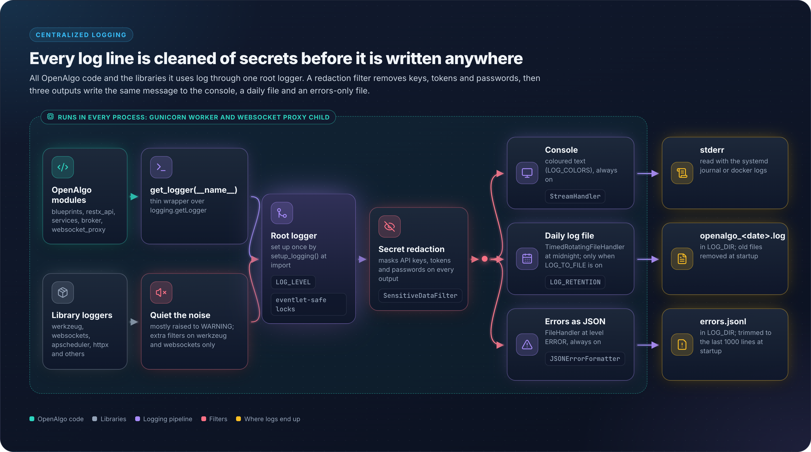

# 16 - Centralized Logging

## Overview

OpenAlgo implements centralized Python logging with configurable levels, colored console output, and optional retained files. General application logs are not stored in `logs.db`: `logs.db` is the traffic/security store, while order and analyzer audit rows live in the main database.

## Architecture Diagram

<figure><figcaption></figcaption></figure>

## Configuration

### Environment Variables

Defaults below are the values `utils/logging.py` falls back to when the variable is
unset.

```bash
# Enable/disable file logging (default: False)
LOG_TO_FILE='False'

# Log level: DEBUG, INFO, WARNING, ERROR, CRITICAL (default: INFO)
LOG_LEVEL='INFO'

# Log directory (default: log)
LOG_DIR='log'

# Log format
LOG_FORMAT='[%(asctime)s] %(levelname)s in %(module)s: %(message)s'

# Days of rotated log files to retain (default: 14)
LOG_RETENTION='14'

# Colored console output (default: True)
LOG_COLORS='True'
```

## Usage

### Getting a Logger

```python
from utils.logging import get_logger

logger = get_logger(__name__)

# Log at different levels
logger.debug("Debug message")
logger.info("Info message")
logger.warning("Warning message")
logger.error("Error message")
logger.critical("Critical message")
```

### Log Levels

| Level | Value | Use Case |
|-------|-------|----------|
| DEBUG | 10 | Detailed debugging information |
| INFO | 20 | General operational messages |
| WARNING | 30 | Something unexpected happened |
| ERROR | 40 | Error occurred, operation failed |
| CRITICAL | 50 | System is unusable |

## Implementation

**Location:** `utils/logging.py`

Handlers are attached once to the **root** logger by `setup_logging()`, which runs at
module import. `get_logger(name)` is only a thin wrapper around `logging.getLogger(name)`,
so per-module loggers inherit the root configuration.

```python
import logging
import os
from logging.handlers import TimedRotatingFileHandler

def setup_logging():
    """Initialize the logging configuration from environment variables."""
    root_logger = logging.getLogger()
    root_logger.setLevel(getattr(logging, log_level, logging.INFO))
    root_logger.handlers = []

    sensitive_filter = SensitiveDataFilter()

    # Console handler - ColoredFormatter honours LOG_COLORS
    console_handler = logging.StreamHandler()
    console_handler.setFormatter(ColoredFormatter(log_format, enable_colors=log_colors))
    console_handler.addFilter(sensitive_filter)
    root_logger.addHandler(console_handler)

    # File handler (only when LOG_TO_FILE=True) - rotates daily at midnight
    if log_to_file:
        cleanup_old_logs(log_path, log_retention)
        log_file = log_path / f"openalgo_{datetime.now().strftime('%Y-%m-%d')}.log"
        file_handler = TimedRotatingFileHandler(
            filename=str(log_file),
            when="midnight",
            interval=1,
            backupCount=log_retention,
            encoding="utf-8",
        )
        file_handler.setFormatter(logging.Formatter(log_format))
        file_handler.addFilter(sensitive_filter)
        root_logger.addHandler(file_handler)

    # JSON error log - always active, ERROR and above, log/errors.jsonl
    json_handler = logging.FileHandler(filename=str(errors_file), encoding="utf-8")
    json_handler.setLevel(logging.ERROR)
    json_handler.setFormatter(JSONErrorFormatter())
    json_handler.addFilter(sensitive_filter)
    root_logger.addHandler(json_handler)


def get_logger(name: str) -> logging.Logger:
    """Get a logger instance for a module."""
    return logging.getLogger(name)


# Initialize logging on import
setup_logging()
```

### Filters And Noise Suppression

| Class | Effect |
|-------|--------|
| `SensitiveDataFilter` | Redacts credentials and tokens from every handler |
| `ColoredFormatter` | Level-based console colors, controlled by `LOG_COLORS` |
| `JSONErrorFormatter` | Structured `ERROR`+ records for `log/errors.jsonl` |
| `WerkzeugErrorFilter` | Drops known development-server noise |
| `WebSocketHandshakeFilter` | Drops short-lived WebSocket handshake errors |

`setup_logging()` also raises the level of `werkzeug`, `urllib3`, `requests`, `httpx`,
`httpcore`, `hpack`, `apscheduler`, `websockets` and `telegram` loggers so third-party
chatter stays out of the console.

### Error Log

`log/errors.jsonl` is written unconditionally, independent of `LOG_TO_FILE`. It captures
`ERROR` and above as one JSON object per line and is truncated to the last 1000 entries at
startup so it cannot grow without bound.

## Log Categories

### Application Logs

| Category | Logger Name | Description |
|----------|-------------|-------------|
| Auth | `blueprints.auth` | Login/logout events |
| Orders | `restx_api.place_order` | Order placement |
| WebSocket | `websocket_proxy` | WS connections |
| Strategy | `blueprints.strategy` | Strategy execution |

### Example Log Output

```
[2024-01-15 09:30:15] INFO in auth: User admin logged in successfully
[2024-01-15 09:30:20] INFO in place_order: Order placed - SBIN BUY 100 MIS
[2024-01-15 09:30:21] DEBUG in broker_api: Broker response: {"orderid": "123456"}
[2024-01-15 09:31:00] WARNING in session: Session expiring in 5 minutes
[2024-01-15 15:30:00] INFO in squareoff: Auto square-off triggered for MIS positions
```

## Startup Banner

```python
from utils.logging import log_startup_banner

def log_startup_banner(logger_instance, title: str, url: str,
                       separator_char: str = "=", width: int = 60):
    """Log a highlighted startup banner with a single URL."""

log_startup_banner(logger, "OpenAlgo is running", "http://127.0.0.1:5000")
```

The banner is three logged lines between two separator lines of `separator_char`, not a
drawn box. Colors come from colorama and are suppressed when `LOG_COLORS` is false unless
`FORCE_COLOR` is set. `app.py` imports the helper but does not currently call it.

Sample output at the default `separator_char="="` and `width=60`:

```
============================================================
OpenAlgo is running
Access the application at: http://127.0.0.1:5000
============================================================
```

## File Rotation

```
log/
├── openalgo_2026-08-23.log    # Today, written while LOG_TO_FILE=True
├── openalgo_2026-08-22.log    # Rolled at midnight
├── ...
├── openalgo_2026-08-09.log    # Oldest kept, backupCount=LOG_RETENTION
├── errors.jsonl               # ERROR and above, always on
└── strategies/                # Per-strategy subprocess logs
```

Rotation is time based, not size based. `TimedRotatingFileHandler` rolls at midnight and keeps `LOG_RETENTION` days of history.

### Rotation Settings

| Setting | Value in code | Description |
|---------|---------------|-------------|
| Handler | `TimedRotatingFileHandler` | Time based, not size based |
| When | `midnight`, `interval=1` | One rotation per day |
| Backup Count | `LOG_RETENTION` (default 14) | Number of rotated files to keep |
| Encoding | `utf-8` | File handler encoding |
| Startup cleanup | `cleanup_old_logs(log_dir, retention_days)` | Deletes files older than the retention window |
| Compression | None | Rotated files are not compressed |

## Viewing Logs

### File Logs

```bash
# View today's log
cat log/openalgo_$(date +%F).log

# Follow log in real-time
tail -f log/openalgo_$(date +%F).log

# View last 100 lines
tail -100 log/openalgo_$(date +%F).log

# Search for errors
grep ERROR log/openalgo_$(date +%F).log

# Structured error records (always written)
tail -f log/errors.jsonl
```

### UI Log Viewer

`blueprints/log.py` serves the order-log viewer at `/logs` (with `/logs/export`), and
`blueprints/logging.py` serves the consolidated dashboard at `/logging`, which links
live logs, analyzer logs, traffic, latency and security views.

## Key Files Reference

| File | Purpose |
|------|---------|
| `utils/logging.py` | `setup_logging()`, `get_logger()`, formatters and filters |
| `blueprints/log.py` | Order log viewer at `/logs` and `/logs/export` |
| `blueprints/logging.py` | Consolidated logging dashboard at `/logging` |
| `database/apilog_db.py` | Order API audit rows in the main database |
| `database/analyzer_db.py` | Analyzer audit rows in the main database |
| `database/traffic_db.py` | Request traffic rows in `logs.db` |
| `log/` | Dated log files plus `errors.jsonl` |
