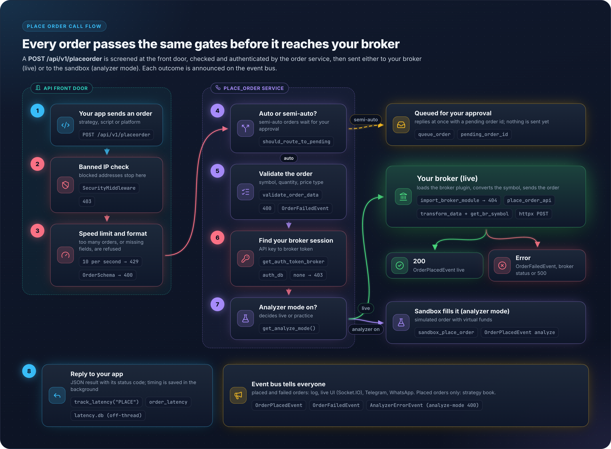
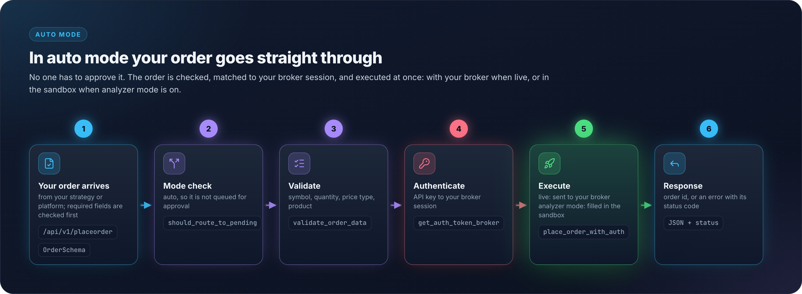
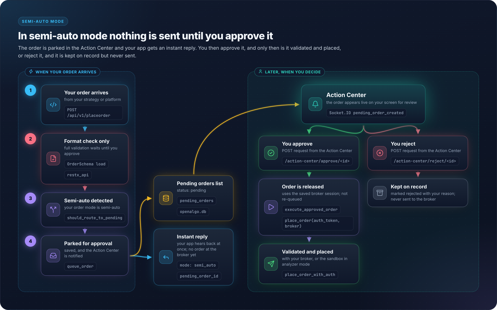
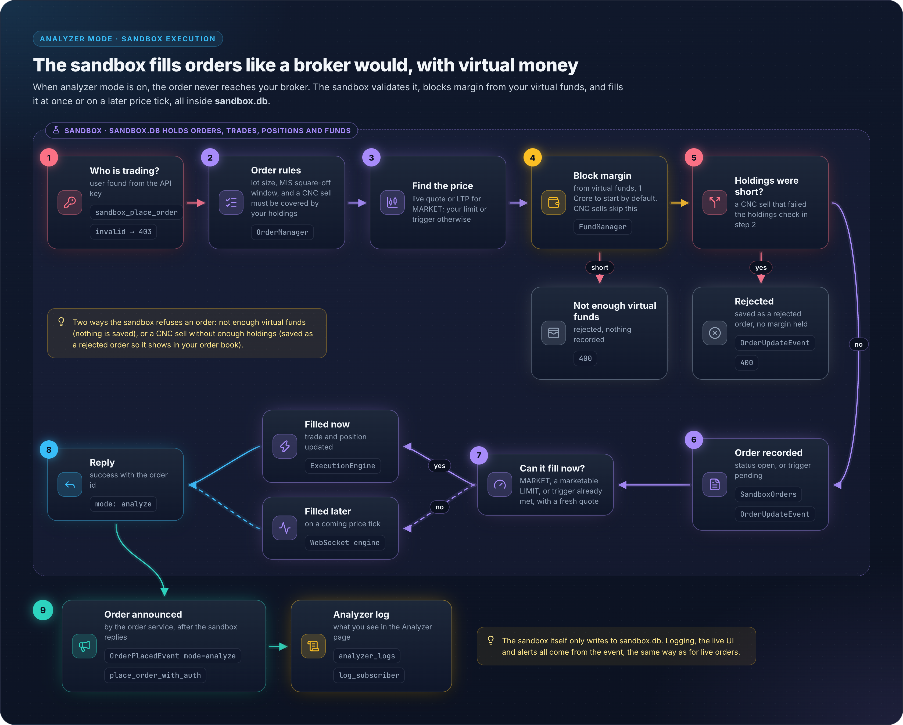
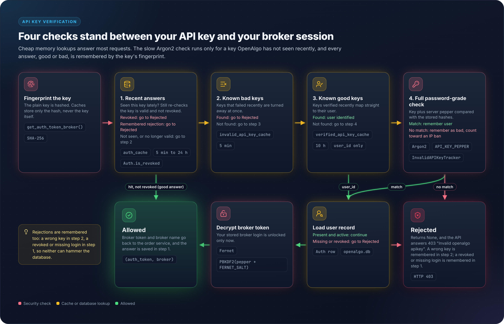

# 19 - PlaceOrder Call Flow

## Overview

The PlaceOrder API is the core order execution endpoint in OpenAlgo. It handles order validation, authentication, broker routing, and response processing through multiple layers.

## Complete Flow Diagram

<figure><figcaption></figcaption></figure>

## Request Format

### Basic Order Request

```json
{
    "apikey": "your_api_key",
    "strategy": "MyStrategy",
    "symbol": "SBIN",
    "exchange": "NSE",
    "action": "BUY",
    "quantity": 100,
    "product": "MIS",
    "pricetype": "MARKET"
}
```

### Limit Order

```json
{
    "apikey": "your_api_key",
    "strategy": "MyStrategy",
    "symbol": "INFY",
    "exchange": "NSE",
    "action": "BUY",
    "quantity": 50,
    "product": "CNC",
    "pricetype": "LIMIT",
    "price": 1650.00
}
```

### Stop-Loss Order

```json
{
    "apikey": "your_api_key",
    "strategy": "MyStrategy",
    "symbol": "NIFTY21JAN2521500CE",
    "exchange": "NFO",
    "action": "BUY",
    "quantity": 65,
    "product": "MIS",
    "pricetype": "SL",
    "price": 250.00,
    "trigger_price": 245.00
}
```

## Validation Rules

### Mandatory Fields

| Field | Type | Description |
|-------|------|-------------|
| apikey | string | OpenAlgo API key |
| strategy | string | Strategy identifier |
| symbol | string | Trading symbol |
| exchange | string | Exchange code |
| action | string | BUY or SELL |
| quantity | integer | Order quantity (≥1) |

### Valid Values

`utils/constants.py` is the single source of truth:

```
VALID_EXCHANGES:    NSE, NFO, CDS, BSE, BFO, BCD, MCX, NCDEX, NCO,
                    NSE_INDEX, BSE_INDEX, MCX_INDEX, GLOBAL_INDEX, CRYPTO

VALID_ACTIONS:      BUY, SELL
                    OrderSchema also accepts lowercase buy and sell

VALID_PRICE_TYPES:  MARKET, LIMIT, SL, SL-M

VALID_PRODUCT_TYPES: CNC (delivery), MIS (intraday), NRML (F&O carryforward)
```

Defaults when the field is omitted come from `OrderSchema` and `utils/constants.py`: `pricetype` defaults to `MARKET`, `product` to `MIS`, and `price`, `trigger_price` and `disclosed_quantity` to `"0"`. `quantity` arrives as a float and is coerced to an integer by the schema's `coerce_quantity` post-load hook.

## Order Routing Modes

### Auto Mode (Default)

<figure><figcaption></figcaption></figure>

Orders are executed immediately without manual intervention.

### Semi-Auto Mode

<figure><figcaption></figcaption></figure>

Orders require manual approval before execution.

## Analyzer Mode (Sandbox)

When `analyze_mode = True`:

<figure><figcaption></figcaption></figure>

## Broker Integration

### Dynamic Module Loading

```python
def import_broker_module(broker_name):
    module_path = f'broker.{broker_name}.api.order_api'
    return importlib.import_module(module_path)
```

### Broker-Specific Implementation

Each broker implements:

```python
def place_order_api(data, auth):
    # 1. Transform data to broker format
    transformed = transform_data(data)

    # 2. Map symbol to broker format
    symbol = get_br_symbol(data['symbol'], data['exchange'])

    # 3. Make HTTP request to broker API
    response = client.post(BROKER_ORDER_URL, data=transformed)

    # 4. Parse response
    order_id = response.json()['data']['order_id']

    return (response, response_data, order_id)
```

## Error Handling

| Error | HTTP Code | Raised in |
|-------|-----------|-----------|
| Marshmallow `ValidationError` | 400 | `restx_api/place_order.py`, before the service is called |
| Missing field, invalid exchange, action, pricetype or product | 400 | `validate_order_data()` in the service |
| Sandbox call without `apikey`, or neither `api_key` nor `auth_token` plus `broker` | 400 | `place_order()` / `place_order_with_auth()` |
| Invalid or revoked API key | 403 | `get_auth_token_broker()` returned `None`; the message is `Invalid openalgo apikey` |
| Broker module import failed | 404 | `import_broker_module()`; the message is `Broker-specific module not found` |
| Broker rejected the order | broker status | `place_order_with_auth()` forwards `res.status`, falling back to 500 |
| Unhandled exception | 500 | `place_order_with_auth()` or the resource's outer `except` |
| Rate limit | 429 | Flask-Limiter, handled by the `@app.errorhandler(429)` in `app.py` |

The resource always returns `make_response(jsonify(response_data), status_code)`, so the status code is whatever the service returned. Nothing in the resource rewrites a broker status into a generic 500.

## Event Bus Side-Effects

All post-order side-effects (logging, Socket.IO, Telegram, WhatsApp) are dispatched through the Event Bus. The service publishes a single typed event; subscribers handle each concern independently.

### Publishing

```python
from events import OrderPlacedEvent
from utils.event_bus import bus

# After a successful broker call, one publish replaces three call sites
bus.publish(OrderPlacedEvent(
    mode="live",
    api_type="placeorder",
    symbol=order_data["symbol"],
    action=order_data["action"],
    orderid=str(order_id),
    request_data=cleaned_request,
    response_data={"status": "success", "orderid": order_id},
    api_key=api_key,
))
```

### What Subscribers Do

`subscribers/__init__.py` subscribes four modules to both `order.placed` and `order.failed`:

| Subscriber | Action |
|------------|--------|
| `log_subscriber` | `_log_event` routes on `event.mode`: `analyze` writes `analyzer_logs` via `async_log_analyzer`, anything else writes `order_logs` via `async_log_order` |
| `socketio_subscriber` | Emits the live order event or the analyzer update to the browser |
| `telegram_subscriber` | Sends the Telegram alert |
| `whatsapp_subscriber` | Sends the WhatsApp alert |

`bus.publish()` never blocks the request thread. `EventBus` dispatches on a shared `ThreadPoolExecutor(max_workers=10, thread_name_prefix="eventbus")` with a bounded pending queue of 1000; over-capacity events are dropped with a warning rather than queued indefinitely.

See [53-event-bus](53-event-bus.md) for full architecture details.

## Security Layers

### API Key Verification

<figure><figcaption></figcaption></figure>

### Request Sanitization

- API keys removed from logs
- Sensitive data encrypted at rest
- Rate limiting per endpoint

## Performance Optimizations

| Optimization | Description |
|--------------|-------------|
| Connection pooling | HTTP clients reuse connections |
| API key caching | Reduce Argon2 hashing overhead |
| Async logging | Non-blocking order logs |
| Thread pool | 10 worker threads for async ops |

## Key Files Reference

| File | Purpose |
|------|---------|
| `restx_api/place_order.py` | REST resource, rate limit, response shaping |
| `restx_api/schemas.py` | `OrderSchema` request validation |
| `services/place_order_service.py` | `place_order`, `place_order_with_auth`, `validate_order_data`, `import_broker_module` |
| `services/order_router_service.py` | Semi-auto routing (`should_route_to_pending`, `queue_order`) |
| `services/sandbox_service.py` | Analyzer-mode entry (`sandbox_place_order`) |
| `sandbox/order_manager.py` | `OrderManager.place_order` simulated execution |
| `database/settings_db.py` | `get_analyze_mode()` mode flag |
| `database/auth_db.py` | `get_auth_token_broker()` and the API key caches |
| `broker/{name}/api/order_api.py` | `place_order_api(data, auth)` |
| `broker/{name}/mapping/transform_data.py` | Data transformation |
| `utils/event_bus.py` | `EventBus` and the module-level `bus` singleton |
| `events/order_events.py` | `OrderPlacedEvent` (`order.placed`), `OrderFailedEvent` (`order.failed`) |
| `subscribers/` | Log, Socket.IO, Telegram and WhatsApp subscribers |
| `database/apilog_db.py` | `order_logs` writes from `log_subscriber` |
| `utils/latency_monitor.py` | `track_latency("PLACE")` wrapper and `order_latency` writes |
