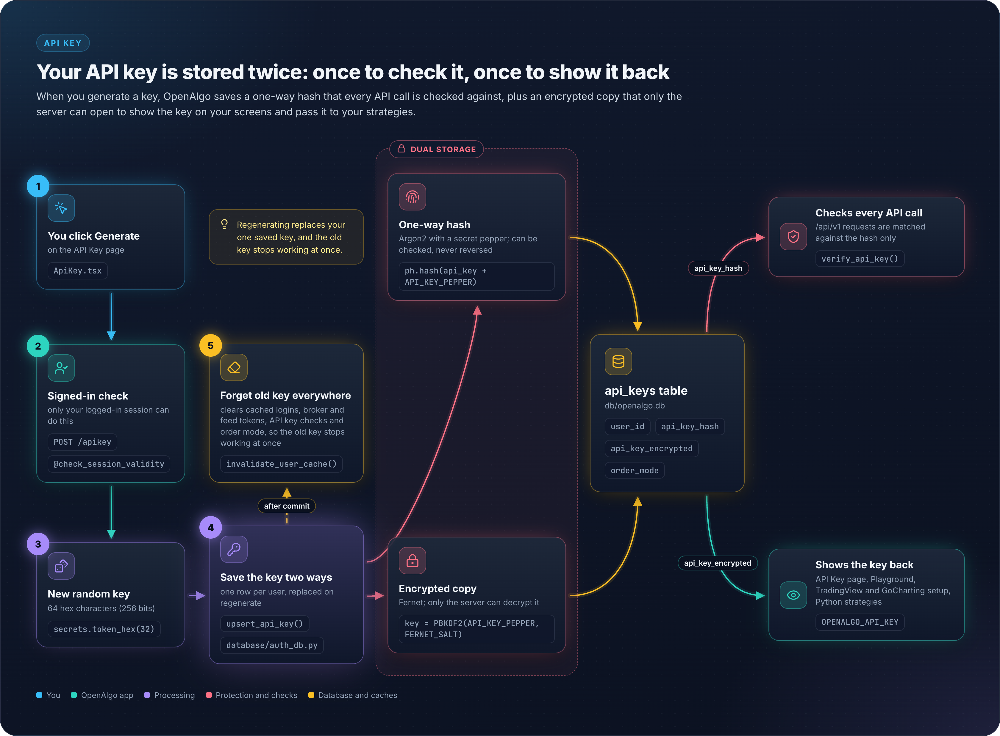
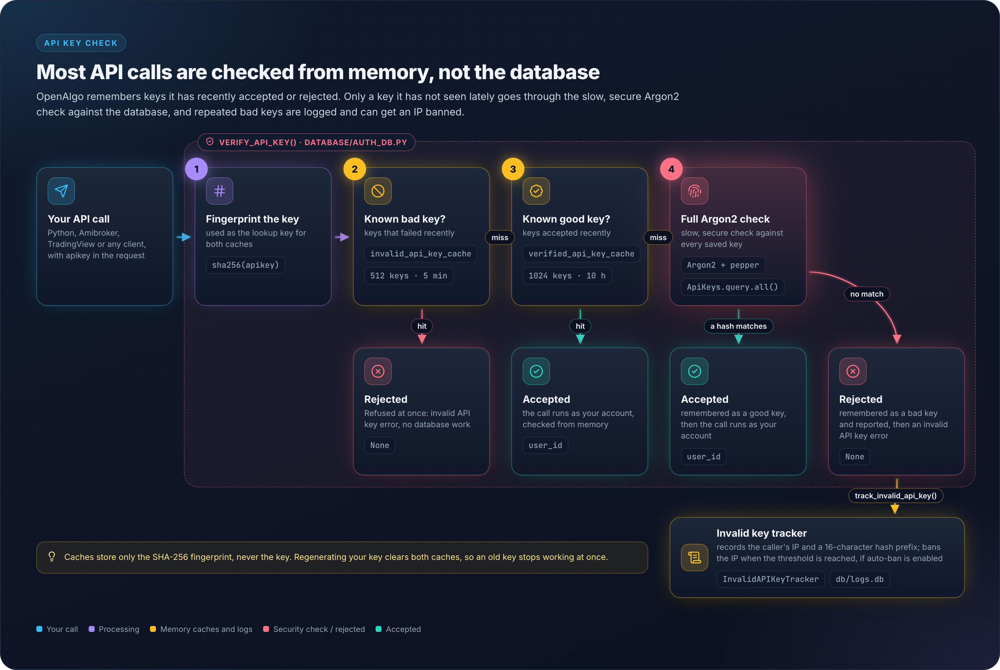
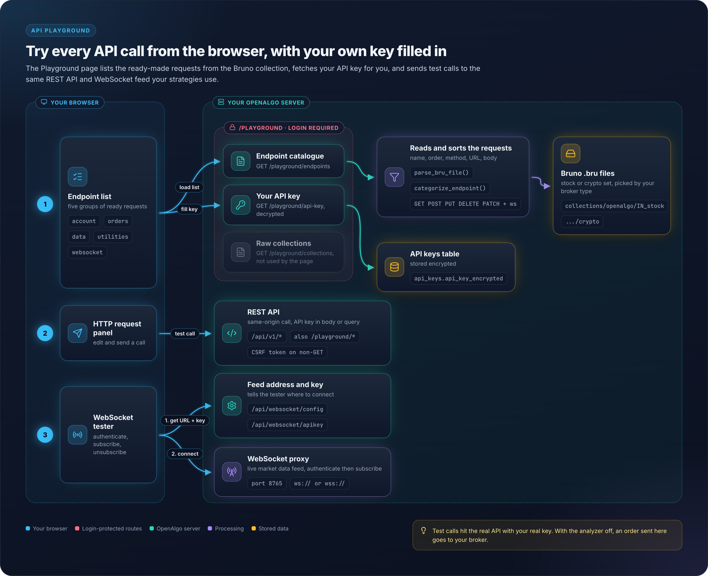

# 37 - API Key & Playground

## Overview

OpenAlgo provides a secure API key management system and an interactive API Playground for testing REST API and WebSocket endpoints. API keys are hashed using Argon2 with pepper for storage and encrypted using Fernet for retrieval.

## Architecture Diagram

<figure><figcaption></figcaption></figure>

## API Key Generation

**Location:** `blueprints/apikey.py`

Blueprint: `api_key_bp`, `url_prefix="/"`. It exposes `/apikey` (GET returns the current key state, POST regenerates the key) and `/apikey/mode` (POST). Both are guarded by `@check_session_validity` and neither carries a `@limiter.limit` decorator.

```python
import secrets

def generate_api_key():
    """Generate a secure random API key"""
    # Generate 32 bytes of random data and encode as hex
    return secrets.token_hex(32)
```

### Key Properties

| Property | Value |
|----------|-------|
| Length | 64 characters (hex) |
| Entropy | 256 bits |
| Format | Hexadecimal (0-9, a-f) |
| Generation | `secrets.token_hex(32)` |

## API Key Storage

### Dual Storage for Different Use Cases

The model is `ApiKeys` in `database/auth_db.py` with `__tablename__ = 'api_keys'`. Its columns are `id`, `user_id` (unique), `api_key_hash`, `api_key_encrypted`, `created_at` and `order_mode` (default `'auto'`).

```python
# database/auth_db.py
def upsert_api_key(user_id, api_key):
    """Store both hashed and encrypted API key"""
    # Hash with Argon2 for verification
    peppered_key = api_key + PEPPER
    hashed_key = ph.hash(peppered_key)

    # Encrypt for retrieval
    encrypted_key = encrypt_token(api_key)

    api_key_obj = ApiKeys.query.filter_by(user_id=user_id).first()
    if api_key_obj:
        api_key_obj.api_key_hash = hashed_key
        api_key_obj.api_key_encrypted = encrypted_key
    else:
        api_key_obj = ApiKeys(
            user_id=user_id, api_key_hash=hashed_key, api_key_encrypted=encrypted_key
        )
        db_session.add(api_key_obj)
    db_session.commit()

    # Security: Invalidate all caches when API key changes
    invalidate_user_cache(user_id)

    return api_key_obj.id
```

`order_mode` is not written by `upsert_api_key()`. It falls back to the column default `'auto'` on insert and is changed only through `update_order_mode()`.

### API Key Verification

<figure><figcaption></figcaption></figure>

Only the SHA-256 cache key and the resolved `user_id` are cached, never the key itself. `upsert_api_key()` and `update_order_mode()` both call `invalidate_user_cache()`. Order mode is cached separately in `order_mode_cache` (TTLCache, maxsize 128, TTL 60 seconds).

## Order Mode

### Auto vs Semi-Auto Mode

| Mode | Description | Use Case |
|------|-------------|----------|
| `auto` | Orders execute immediately | Personal trading |
| `semi_auto` | Orders require manual approval | Managed accounts |

```python
@api_key_bp.route('/apikey/mode', methods=['POST'])
@check_session_validity
def update_api_key_mode():
    """Update order mode (auto/semi_auto) for a user"""
    user_id = request.json.get('user_id')
    mode = request.json.get('mode')  # 'auto' or 'semi_auto'

    if mode not in ['auto', 'semi_auto']:
        return jsonify({'error': 'Invalid mode'}), 400

    success = update_order_mode(user_id, mode)
    return jsonify({'mode': mode})
```

## API Playground

**Location:** `blueprints/playground.py`

### Architecture

<figure><figcaption></figcaption></figure>

### Endpoint Categories

`categorize_endpoint()` matches against the lowercased path and returns one of `account`, `orders`, `data` or `utilities`. WebSocket entries bypass it: `load_bruno_endpoints()` assigns them to a fifth bucket, `websocket`, based on the `.bru` meta `type`.

```python
def categorize_endpoint(path):
    """Categorize an endpoint based on its path"""
    path_lower = path.lower()

    # Account endpoints
    if any(x in path_lower for x in ['/funds', '/orderbook', '/tradebook',
                                     '/positionbook', '/holdings',
                                     '/analyzer', '/margin']):
        return 'account'

    # Order endpoints
    if any(x in path_lower for x in ['/placeorder', '/placesmartorder',
                                     '/placegttorder', '/modifygttorder',
                                     '/cancelgttorder', '/gttorderbook',
                                     '/optionsorder', '/optionsmultiorder',
                                     '/basketorder', '/splitorder',
                                     '/modifyorder', '/cancelorder',
                                     '/cancelallorder', '/closeposition',
                                     '/orderstatus', '/openposition',
                                     '/closeall']):
        return 'orders'

    # Data endpoints
    if any(x in path_lower for x in ['/quotes', '/multiquotes', '/depth',
                                     '/history', '/intervals', '/symbol',
                                     '/search', '/expiry', '/optionsymbol',
                                     '/optiongreeks', '/multioptiongreeks',
                                     '/optionchain', '/ticker',
                                     '/syntheticfuture', '/instruments']):
        return 'data'

    # Default to utilities
    return 'utilities'
```

`.bru` files are read from `collections/openalgo/<broker_type>/**/*.bru`, where `broker_type` is `IN_stock` (the default) or `crypto`, resolved from the logged in broker's capabilities. `collection.bru` metadata files are skipped, entries are ordered by the `seq` value in their `meta` block and then sorted alphabetically by name inside each category.

### API Endpoints

Blueprint: `playground`, `url_prefix="/playground"`.

| Endpoint | Method | Description |
|----------|--------|-------------|
| `/playground/` | GET | Legacy URL. Redirects (302) to the React-served `/playground` page |
| `/playground/api-key` | GET | Get user's API key |
| `/playground/collections` | GET | Get Postman/Bruno collections |
| `/playground/endpoints` | GET | Get structured endpoint list |

The playground UI itself is served by the React SPA (`blueprints/react_app.py`), not by a Jinja template in this blueprint. `/playground/api-key`, `/playground/collections` and `/playground/endpoints` are guarded by `@check_session_validity`. `/playground/` is not.

## WebSocket Testing

### WebSocket Endpoint Format in Bruno

```
meta {
  name: Subscribe Symbols
  type: websocket
  seq: 1
}

websocket {
  url: ws://localhost:8765
  description: Subscribe to real-time market data
}

message:json {
  {
    "action": "subscribe",
    "symbols": ["NSE:SBIN-EQ", "NSE:RELIANCE-EQ"]
  }
}
```

### WebSocket Actions

| Action | Description |
|--------|-------------|
| `subscribe` | Subscribe to symbols |
| `unsubscribe` | Unsubscribe from symbols |

## API Usage Examples

### Using API Key in Requests

```python
import requests

API_KEY = "your_64_character_api_key_here"
BASE_URL = "http://localhost:5000/api/v1"

# The /api/v1 endpoints read the key from the JSON body field "apikey"
response = requests.post(
    f"{BASE_URL}/quotes",
    json={
        "apikey": API_KEY,
        "symbol": "SBIN",
        "exchange": "NSE"
    }
)
```

> **Note**: Header authentication with `X-API-KEY` is accepted only by the bot endpoints (`restx_api/telegram_bot.py` and `restx_api/whatsapp_bot.py`). The regular `/api/v1` trading and data endpoints take the key from the request body.

### TradingView Integration

```python
# TradingView webhook URL format
# http://your-domain/api/v1/placeorder

# Webhook payload with API key
{
    "apikey": "your_api_key",
    "symbol": "{{ticker}}",
    "exchange": "NSE",
    "action": "{{strategy.order.action}}",
    "quantity": 1,
    "product": "MIS",
    "pricetype": "MARKET"
}
```

## Security Considerations

### API Key Protection

| Layer | Protection |
|-------|------------|
| Storage | Argon2 hash (`api_key_hash`) plus Fernet encryption (`api_key_encrypted`) |
| Transit | HTTPS recommended |
| Verification | Pepper plus Argon2 `PasswordHasher.verify()` |
| Caching | `verified_api_key_cache` TTL 36000s, `invalid_api_key_cache` TTL 300s, both keyed by SHA-256 of the key and invalidated on key regeneration |

### Playground Security

- Session authentication required
- CSRF protection (exempted for API endpoints)
- API key auto-populated from session
- No API key logging

## Key Files Reference

| File | Purpose |
|------|---------|
| `blueprints/apikey.py` | API key CRUD operations |
| `blueprints/playground.py` | API testing playground |
| `database/auth_db.py` | API key storage/verification |
| `collections/**/*.bru` | Bruno endpoint definitions |
| `frontend/src/pages/ApiKey.tsx` | React API key page |
| `frontend/src/pages/Playground.tsx` | React WebSocket/API playground |
