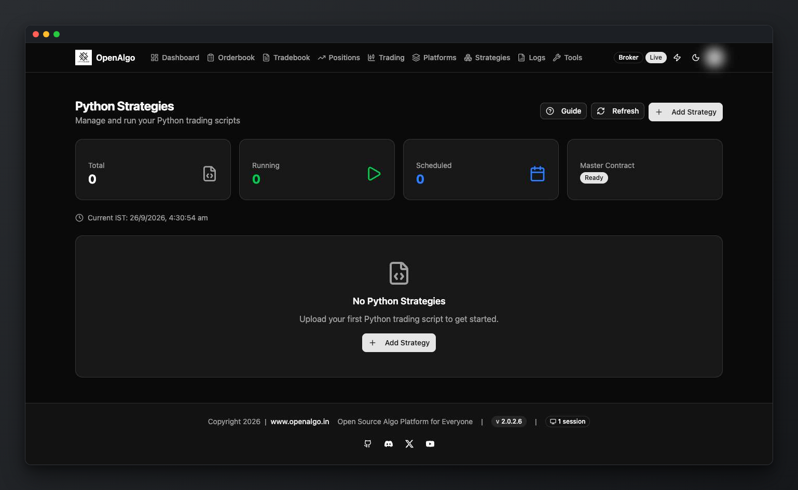
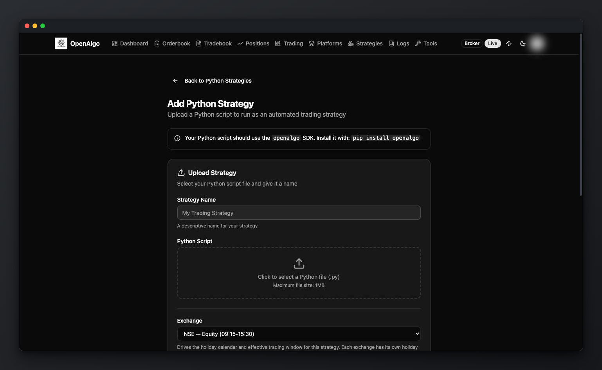

# Python Strategy Hosting

***

## Hosting Python Strategies in OpenAlgo

OpenAlgo hosts trusted Python trading strategies as separate subprocesses. Each run has its own process and log file, but lifecycle and scheduling state are still owned by the single OpenAlgo web worker.



### 1. Accessing the Python Strategy Manager

To begin, log into your OpenAlgo dashboard:

* Click on your **Profile** icon in the top right corner.
* Select **Python Strategies** from the dropdown menu.
* This dashboard provides an overview of your total, running, and scheduled strategies.

<figure><figcaption></figcaption></figure>

### 2. Adding a New Strategy

Click the **Add Strategy** button to open the configuration interface.

<figure><figcaption></figcaption></figure>

#### Uploading the Script

* **Strategy Name:** Enter a unique descriptive name for your strategy.
* **Python Script:** Upload your `.py` file. OpenAlgo supports standard Python libraries and the OpenAlgo SDK.

#### Configuration & Scheduling

* **Exchange:** Select the target exchange (e.g., NSE Equity, MCX Commodity, Crypto). OpenAlgo is holiday-aware and will only run the strategy during valid market hours for the selected exchange.
* **Schedule:** Define the **Start Time**, **Stop Time**, and active days. Scheduling is required. Regular exchanges default to 09:00-16:00 IST on weekdays; crypto can run on all seven days.

### 3. Monitoring & Management

Once a strategy is added, it will appear on your Python Strategies page.

* **Start/Stop:** Use the manual controls to trigger or halt the script execution.
* **View Logs:** Click "View Logs" to see real-time output. This section tracks data fetching, signal generation, and order execution. You can copy or download these logs for debugging.
* **Edit Code:** The built-in code editor allows for quick modifications directly within the browser, though it is recommended to test major changes locally first.

### 4. Execution Modes

OpenAlgo features a toggle to prevent accidental trades during development:

* **Analyzer Mode:** Use this for testing purposes. It allows the script to run and generate logs without sending real orders to the broker.
* **Live Mode:** Once your strategy is verified, switch to Live Mode to enable actual order placement.

### 5. Technical Environment Variables

When your script runs within OpenAlgo, several environment variables are automatically injected. You should use these instead of hardcoding sensitive data:

| Variable | Description |
|---|---|
| `OPENALGO_API_KEY` | Decrypted application API key, when one is configured. |
| `STRATEGY_ID` | Unique identifier for the strategy. |
| `STRATEGY_NAME` | Strategy display name. |
| `OPENALGO_HOST` | Internal host URL for REST requests. |
| `OPENALGO_STRATEGY_EXCHANGE` | Exchange selected in the strategy schedule. |

Do not use the obsolete `OPENALGO_APIKEY` spelling. Build the WebSocket URL from the deployment configuration or your own strategy setting; `OPENALGO_WS_URL` is not one of the values injected by the current process launcher.

### 6. Verifying Orders

After a trade is triggered by your Python strategy, you can verify it in two places:

1. **Strategy Logs:** Shows the logic and parameters that triggered the trade.
2. **Order Book:** Shows the status (Complete, Rejected, etc.) and details (Price, Quantity, Product Type) of the order sent to the broker.

***

#### Best Practices

* Always test new strategies in **Analyzer Mode** for at least one full trading session.
* Use the **Python Strategy Guide** link within the app for updated code snippets and recommended patterns.
* Ensure your OpenAlgo instance has a stable internet connection if running on a local machine to prevent WebSocket disconnections.
* Run only code you trust. Hosted scripts execute as the OpenAlgo operating-system user and inherit the application environment.
* Keep one Gunicorn web worker. Strategy ownership, schedules, and live process state are process-local.
* One open live-log page uses one long-lived server execution slot. Size an experimental gthread deployment for the expected number of simultaneous `/python` tabs and other streams.
* Current main still has known threaded-shutdown risks around Unix `preexec_fn` and forced process-tree cleanup. Do not interpret process isolation as a guarantee of unattended 24x7 lifecycle recovery; after an abnormal server stop, verify that no old strategy process remains.

The production default remains Gunicorn with one eventlet worker. The [gthread migration](../getting-started/gthread-migration.md) is opt-in and experimental until it is merged into the application main branch.
